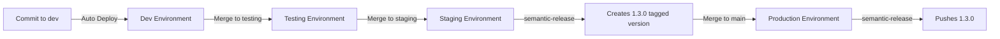

# Application Environments

GitLab Environments provide visibility into where your application is deployed, what version is running, and the health of each deployment. They're automatically created by your CI/CD pipeline configuration.

## What are GitLab Environments?

Think of GitLab Environments as deployment tracking for each stage of your application lifecycle. Every time you deploy, GitLab records:

- 📍 **Where** - Which environment (dev, testing, staging, production)
- 🏷️ **What** - Which version/commit is deployed
- ⏰ **When** - Deployment timestamp
- 👤 **Who** - Who triggered the deployment
- 🔗 **URL** - Direct link to the running application
- ✅ **Status** - Deployment success/failure

---

## Viewing Your Environments

### In GitLab UI

Navigate to: **Your Project > Operate > Environments**


You'll see a table with all your environments:

| Environment | Deployed | Job | Commit | Branch |
|-------------|----------|-----|--------|--------|
| production | 1.3.0 | #456 (2 hours ago) | abc1234 | main |
| staging | 1.3.0 | #455 (5 hours ago) | def5678 | staging |
| testing | b10004a4-SNAPSHOT | #454 (1 day ago) | ghi9012 | testing |
| dev | b10004a4-SNAPSHOT | #453 (1 day ago) | jkl3456 | dev |

### Environment Details

Click any environment to see:

**Deployment History:**
- Who deployed and when
- Pipeline job that did the deployment
- Commit SHA and message

**Monitoring:**
- Link to application URL

---

## How Environments Are Created

Environments are defined in your `.gitlab-ci.yml` file using the `environment` keyword:

### Example Configuration

```yaml
.dev:
  variables:
    CLUSTER_NAME: TF-argo-dev
    NAMESPACE_NAME: einstein-dev
    BRANCH: dev
  environment:
    name: dev
    url: https://einstein.dev.argo-dev.eks.mdtcloud.io

dev-deploy:
  extends: [.dev, .deploy-kustomize-base]
  stage: deploy
  script:
    - echo "Deploying to dev environment..."
```

**Key components:**

| Field | Purpose | Example |
|-------|---------|---------|
| `environment.name` | Environment identifier (unique) | `dev`, `testing`, `staging`, `release`, or `production` |
| `environment.url` | Direct link to deployed app | `https://einstein.dev.argo-dev.eks.mdtcloud.io` |
| `environment.on_stop` | Job to run when stopping (optional) | `stop-dev` |
| `environment.action` | Deployment action type | `start`, `stop`, `prepare` |
| `environment.auto_stop_in` | Auto-stop after duration (optional) | `1 day`, `1 week` |

**Learn more:** See [GitLab Environments Documentation](https://docs.gitlab.com/ci/environments/) for additional configuration options and advanced features.

---

## Standard Environment Configuration

### Development Environment

```yaml
.dev:
  variables:
    CLUSTER_NAME: TF-argo-dev
    DIR: TF-argo-dev/apps
    PROMOTION_LEVEL: dev
    NAMESPACE_NAME: einstein-dev
    BRANCH: dev
    EKS_REGION: us-east-1
  environment:
    name: dev
    url: https://einstein.dev.argo-dev.eks.mdtcloud.io
```

**Characteristics:**
- Cluster: `TF-argo-dev` (shared development cluster)
- Deployment: Automatic on push to `dev` branch
- Version: `COMMIT_SHA-SNAPSHOT` (mutable)
- Access: Open to development team

### Testing Environment

```yaml
.testing:
  variables:
    CLUSTER_NAME: TF-argo-dev
    DIR: TF-argo-dev/apps
    PROMOTION_LEVEL: testing
    NAMESPACE_NAME: einstein-testing
    BRANCH: testing
    EKS_REGION: us-east-1
  environment:
    name: testing
    url: https://einstein.testing.argo-dev.eks.mdtcloud.io
```

**Characteristics:**
- Cluster: `TF-argo-dev` (shared development cluster, separate namespace)
- Deployment: Automatic or manual on `testing` branch
- Version: `COMMIT_SHA-SNAPSHOT` (mutable)
- Access: QA team, developers

### Staging Environment

```yaml
.staging:
  variables:
    CLUSTER_NAME: TF-argo-prd
    DIR: TF-argo-prd/apps
    PROMOTION_LEVEL: staging
    NAMESPACE_NAME: einstein-staging
    BRANCH: staging
    EKS_REGION: us-east-1
  environment:
    name: staging
    url: https://einstein.staging.argo-prd.eks.mdtcloud.io
```

**Characteristics:**
- Cluster: `TF-argo-prd` (production cluster, staging namespace)
- Deployment: Manual or automatic on `staging` branch
- Version: `X.Y.Z` (release candidate)
- Access: Product team, QA, stakeholders
- **Security:** Must pass vulnerability policy

### Production Environment

```yaml
.prod:
  variables:
    CLUSTER_NAME: TF-argo-prd
    DIR: TF-argo-prd/apps
    PROMOTION_LEVEL: production
    NAMESPACE_NAME: einstein-production
    BRANCH: main
    EKS_REGION: us-east-1
  environment:
    name: production
    url: https://einstein.argo-prd.eks.mdtcloud.io
```

**Characteristics:**
- Cluster: `TF-argo-prd` (production cluster, production namespace)
- Deployment: **Manual only** (requires approval)
- Version: `X.Y.Z` (immutable, semantic version)
- Access: End users, customers
- **Security:** Must pass vulnerability policy + manual approval

---

## Deployment Flow Across Environments



### Promotion Path

**1. Develop in `dev`**
```bash
git checkout dev
git commit -m "feat: add user dashboard"
git push origin dev
```
→ Auto-deploys to **dev environment** as `${COMMIT_SHA}-SNAPSHOT`

**2. Promote to `testing`**
```bash
git checkout testing
git merge dev
git push origin testing
```
→ Deploys to **testing environment** as `${COMMIT_SHA}-SNAPSHOT`

**3. Promote to `staging`**
```bash
git checkout staging
git merge testing
git push origin staging
```
→ semantic-release tags `${COMMIT_SHA}-SNAPSHOT` as `1.3.0`
→ Deploys to **staging environment** as `1.3.0`

**4. Release to `production`**
```bash
git checkout main
git merge staging
git push origin main
```
→ **Manual approval required** (click "Play" button in GitLab)
→ Deploys to **production environment** as `1.3.0`

---

## Deployment Actions

### Viewing Deployment Status

**GitLab > Operate > Environments > [Environment Name]**

**Deployment information:**
- ✅ **Success** - Deployment completed, app is running
- ⏳ **Running** - Deployment in progress
- ❌ **Failed** - Deployment failed (check logs)
- 🔄 **Rolling back** - Reverting to previous version

### Manual Deployment

For protected environments (usually staging and production), you must manually trigger deployment:

1. Go to **CI/CD > Pipelines**
2. Find the pipeline for your commit
3. Navigate to the deploy stage
4. Click the **Play** button (▶️) next to the deployment job


### Rollback

If a deployment causes issues, you can rollback to a previous version:

**Option 1: Git Revert (Recommended)**

Revert the problematic commit(s) to undo changes:

```bash
# Find the commit that caused the issue
git log --oneline

# Revert the commit (creates a new commit that undoes the changes)
git revert <commit-sha>
git push origin <branch-name>
```

This triggers a new pipeline that deploys the reverted code, effectively rolling back your application.

**Option 2: Manual Image Tag Update**

Update the image tag in your project's kustomization file to point to the previous version:

1. Checkout the branch for the environment you need to rollback (e.g., `main` for production, `staging` for staging):
   ```bash
   git checkout main  # or staging, testing, dev
   ```

2. Edit your app's kustomization file:
   ```
   k8s/production/kustomization.yaml  # or staging, testing, dev
   ```

3. Update the `newTag` to the previous working version:
   ```yaml
   images:
   - name: compass-ci-playbook
     newName: case.artifacts.medtronic.com/...
     newTag: 1.2.5  # Change to previous working version
   ```

4. Commit and push the change:
   ```bash
   git add k8s/production/kustomization.yaml
   git commit -m "fix: rollback to version 1.2.5"
   git push origin main
   ```

5. The pipeline will run and deploy the previous version automatically

<!--
**GitLab Rollback Button (Currently Not Functional):**

The GitLab UI rollback feature is not currently working as expected for our GitOps deployment model.
The steps below are commented out until this functionality is properly configured:

1. Go to **Operate > Environments > [Environment]**
2. Find the previous successful deployment
3. Click **Rollback** button
4. Confirm rollback
-->

**Note:** Rollback doesn't revert database migrations or data changes. Handle those separately.

---

## Environment URLs

Each environment has a direct URL to the deployed application:

### URL Pattern

#### AWS EKS
Below is the default URL pattern for applications deployed in AWS EKS clusters.
```
https://{app-name}.{environment}.{cluster}.eks.mdtcloud.io
```

**Examples:**

| Environment | URL |
|-------------|-----|
| Dev | `https://einstein.dev.argo-dev.eks.mdtcloud.io` |
| Testing | `https://einstein.testing.argo-dev.eks.mdtcloud.io` |
| Staging | `https://einstein.staging.argo-prd.eks.mdtcloud.io` |
| Production | `https://einstein.argo-prd.eks.mdtcloud.io` |

**Note:** See [Platform Inventory](../platform-inventory/index.md) for your specific cluster's URL patterns and network configuration.

### Custom Domains

Production often uses a custom hostname:

```yaml
.prod:
  environment:
    name: production
    url: https://myapp.medtronic.com
```

See: [Custom Hostname How-To Guide](../how-to/web-access-hostnames.md)

---

## Environment Variables

Each environment can have unique configuration via pipeline variables:

### Project-Level Variables

**Settings > CI/CD > Variables**

Scope variables to specific environments:

| Variable | Value | Environment | Protected | Masked |
|----------|-------|-------------|-----------|--------|
| `DATABASE_URL` | `postgres://dev-db` | dev | No | Yes |
| `DATABASE_URL` | `postgres://staging-db` | staging | Yes | Yes |
| `DATABASE_URL` | `postgres://prod-db` | production | Yes | Yes |

### Environment-Specific Config

In your pipeline:

```yaml
.dev:
  variables:
    LOG_LEVEL: debug
    FEATURE_FLAGS: "new-ui=true,beta-features=true"

.prod:
  variables:
    LOG_LEVEL: info
    FEATURE_FLAGS: "new-ui=false,beta-features=false"
```

---

## Monitoring & Observability

### Health Checks

GitLab can monitor environment health via external URLs:

```yaml
environment:
  name: production
  url: https://einstein.argo-prd.eks.mdtcloud.io
  action: start
```

GitLab will periodically check the URL and report status:
- ✅ **Available** - HTTP 200 response
- ⚠️ **Degraded** - Slow response or intermittent failures
- ❌ **Unavailable** - HTTP error or timeout


## Environment Protection

### Protected Environments

Restrict who can deploy to production:

**Settings > CI/CD > Protected Environments**

1. Add environment name: `production`
2. Set "Allowed to deploy":
   - Maintainers
   - Specific users
   - Specific groups
3. Set "Approval rules" (optional):
   - Require N approvals before deployment
   - Specify required approvers

**Effect:**
- Only authorized users see "Play" button on production deploy jobs
- Unauthorized users cannot trigger production deployments
- Audit trail of who deployed to production

### Deployment Approvals

Require explicit approval before deploying to production:

```yaml
production-deploy:
  extends: [.prod, .deploy-kustomize-production]
  environment:
    name: production
    url: https://einstein.argo-prd.eks.mdtcloud.io
  when: manual
  needs:
    - job: semantic-release
      artifacts: true
  rules:
    - if: $CI_COMMIT_BRANCH == $CI_DEFAULT_BRANCH
```

**`when: manual`** requires a human to click "Play" button in GitLab.

**Optional: Add approval gate:**

**Settings > General > Merge request approvals**
- Require approval before merging to `main`
- Approval = permission to deploy to production

---

## Best Practices

### Naming Conventions

**Use approved environment names:**
- ✅ `dev`, `testing`, `staging`, `production`
- ❌ `development`, `test`, `stage`, `prod` (inconsistent)

### Environment URLs

**Always include environment URLs:**
- Makes it easy to access deployed apps
- Enables health monitoring
- Provides quick navigation from GitLab

### Manual Deployments for Production

**Always use `when: manual` for production:**
```yaml
production-deploy:
  when: manual
```

**Prevents:**
- Accidental production deployments
- Deployments during business hours
- Deployments without proper preparation

### Auto-Stop for Review Apps

**Clean up temporary environments:**
```yaml
environment:
  name: review/$CI_COMMIT_REF_SLUG
  on_stop: stop-review
  auto_stop_in: 7 days
```

**Prevents:**
- Unused environments consuming resources
- Cluster namespace pollution
- Confusion about which environments are active

---

## Troubleshooting

### Environment not showing in GitLab

**Check:**
1. `environment` keyword present in job definition?
2. Job actually ran (not skipped)?
3. Job succeeded?

**Fix:** Environment only appears after successful deployment.

### Wrong URL in environment

**Check:**
1. `environment.url` matches actual application URL
2. Ingress/routing configured correctly in Kubernetes

**Fix:** Update `environment.url` in pipeline configuration.

### Can't deploy to environment

**Check:**
1. Is environment protected?
2. Do you have "Maintainer" role or higher?
3. Are you in the "Allowed to deploy" list?

**Fix:** Contact project owner to grant deployment permissions.

### Environment stuck in "Running" state

**Possible causes:**
1. Deployment job never completed
2. Job timed out
3. GitLab lost connection during deployment

**Fix:**
- Cancel the running deployment
- Re-run the pipeline
- Check deployment logs for errors

---

## Environment Lifecycle

### Creating Environments

Environments are created automatically when:
1. Pipeline job runs with `environment` keyword
2. Job succeeds

**No manual setup required.**

### Updating Environments

Each deployment updates the environment:
- New version tracked
- Deployment history recorded
- Monitoring continues

### Stopping Environments

**Manual stop:**
1. Go to **Operate > Environments**
2. Click **Stop** button for environment
3. Confirm

**Automatic stop:**
```yaml
environment:
  auto_stop_in: 1 week
```

**What happens:**
- Runs `on_stop` job (if defined)
- Environment marked as "stopped" in GitLab
- **Does NOT** delete Kubernetes resources automatically
- You must handle cleanup in `on_stop` job

### Deleting Environments

**In GitLab:**
1. Stop the environment first
2. Go to **Operate > Environments > Stopped**
3. Click **Delete** button

**Note:** This only removes tracking from GitLab. Kubernetes resources remain until manually deleted.

---

## Example: Complete Environment Configuration

Here's a complete real-world configuration for the Einstein app:

```yaml
# Dev environment
.dev:
  variables:
    CLUSTER_NAME: TF-argo-dev
    NAMESPACE_NAME: argo-einstein-dev
    BRANCH: dev
    PROMOTION_LEVEL: dev
    EKS_REGION: us-east-1
  environment:
    name: dev
    url: https://einstein.dev.argo-dev.eks.mdtcloud.io

dev-deploy:
  extends: [.dev, .deploy-kustomize-base]
  stage: deploy
  rules:
    - if: $CI_COMMIT_BRANCH == "dev"

# Production environment
.prod:
  variables:
    CLUSTER_NAME: TF-argo-prd
    NAMESPACE_NAME: einstein-production
    BRANCH: main
    PROMOTION_LEVEL: production
    EKS_REGION: us-east-1
  environment:
    name: production
    url: https://einstein.argo-prd.eks.mdtcloud.io

production-deploy:
  extends: [.prod, .deploy-kustomize-production]
  stage: deploy
  when: manual
  needs:
    - job: semantic-release
      artifacts: true
    - job: gciso-policy-evaluation
      artifacts: false
  rules:
    - if: $CI_COMMIT_BRANCH == $CI_DEFAULT_BRANCH
```

---

## Quick Reference

### Environment Definition Template

```yaml
.{env-name}:
  variables:
    CLUSTER_NAME: {cluster}
    NAMESPACE_NAME: {namespace}
    BRANCH: {branch}
  environment:
    name: {env-name}
    url: https://{app}.{env}.{cluster}.eks.mdtcloud.io

{env-name}-deploy:
  extends: [.{env-name}, .deploy-template]
  stage: deploy
  when: manual  # Optional: require manual trigger
  rules:
    - if: $CI_COMMIT_BRANCH == "{branch}"
```

### Environment Status Icons

| Icon | Status | Meaning |
|------|--------|---------|
| ✅ | Success | Deployment completed successfully |
| ⏳ | Running | Deployment in progress |
| ❌ | Failed | Deployment failed |
| ⏹️ | Stopped | Environment stopped/inactive |
| 🔄 | Rolling back | Reverting to previous version |

---

## Next Steps

[!ref icon="workflow" text="Pipeline Stages & Jobs"](./pipeline-stages.md)

[!ref icon="rocket" text="Semantic Versioning"](./semantic-versioning.md)

[!ref icon="shield" text="Security GitLab Work items"](./security-gitlab-issues.md)

[!ref icon="globe" text="Custom Hostname Setup"](../how-to/web-access-hostnames.md)
