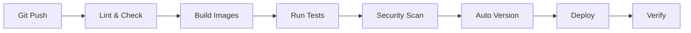

# CI/CD Pipeline

Compass CI automates your entire build, test, release, and deployment workflow using GitLab CI and semantic-release.

## How It Works

Every commit to your repository triggers an automated pipeline:



1. **Commit validation** - Ensures your commits follow conventions
2. **Build** - Creates container images for each environment
3. **Test & Scan** - Runs tests and security scans
4. **Release** - Automatically determines version and creates release
5. **Deploy** - Pushes to Kubernetes via Flux GitOps
6. **Verify** - Confirms deployment health

---

## 📚 Comprehensive Guides

### [Pipeline Stages & Jobs](./pipeline-stages.md)
Complete reference for all 9 pipeline stages, what each job does, and when they run.

**Learn about:**
- Stage-by-stage pipeline execution
- Job triggers and conditional rules
- Pipeline customization with custom jobs and `rules:changes`
- Security scanning workflow
- Deployment orchestration

### [Pipeline Customization](./pipeline-customization.md)
Ready-to-use examples for customizing `.gitlab-ci.yml` behavior without changing shared templates.

**Learn about:**
- Adding custom app jobs
- Overriding shared jobs with the same job name
- Java, Node.js, and Python `rules:changes` patterns
- Reusable YAML anchors for shared file sets

### [Semantic Versioning](./semantic-versioning.md)
How Compass CI automatically versions your releases based on commit messages.

**Learn about:**
- Conventional Commits format
- Version calculation (major.minor.patch)
- GitLab tags and release notes
- .releaserc.json configuration

### [GitLab Environments](./gitlab-environments.md)
Track deployments across dev, testing, staging, and production environments.

**Learn about:**
- Environment definitions and URLs
- Deployment history and tracking
- Rollback procedures
- Protection rules

### [Security & GitLab Work items](./security-gitlab-issues.md)
Automatic vulnerability tracking and remediation enforcement.

**Learn about:**
- Container and dependency scanning
- GitLab Work items for vulnerabilities
- Time-based remediation policies
- Security blocking rules

### [Kubernetes Validation](./kubernetes-validation.md)
How Kubernetes manifests are validated during CI/CD pipeline execution.

**Learn about:**
- Trivy security scanning in the lint stage
- Understanding test results and failures
- Suppressing false positives with .trivyignore.yaml
- Policy enforcement at CI and cluster levels

---

## Quick Start

### For New Applications

1. **Add `.gitlab-ci.yml`** to your repository
   - Copy from [Einstein example](https://medtronic.gitlab-dedicated.com/bcp_web/common/einstein/-/blob/main/.gitlab-ci.yml)
   - Configure for your language/framework

2. **Configure semantic-release**
   - Add `.releaserc.json` for release automation
   - Add `commitlint.config.js` for commit validation

3. **Push a commit** with conventional format
   ```bash
   git commit -m "feat: add user dashboard"
   git push origin main
   ```

4. **Watch the pipeline** in GitLab CI/CD → Pipelines

**Need help?** See [Getting Started](../getting-started/index.md) for complete onboarding instructions.

---

## Key Concepts

### Automated Versioning

**No manual version bumps!** Compass CI reads your commit messages and automatically:
- Determines the next version (1.2.3 → 1.3.0)
- Creates Git tags (v1.3.0)
- Generates release notes
- Updates CHANGELOG.md

### Security-First

Every image is scanned before deployment:
- **Trivy** scans for OS and application vulnerabilities
- **SAST** detects security issues in code
- **Dependency scanning** finds vulnerable libraries
- **GitLab Work items** track remediation with due dates

### GitOps Deployment

Deployments use **Flux CD** for GitOps:
- Declarative configuration in flux-gitops repository
- Automatic reconciliation every 5 minutes
- Health checks and rollback on failure
- Full deployment history in Git

---

## Pipeline Configuration Files

| File | Purpose | Required |
|------|---------|----------|
| `.gitlab-ci.yml` | Pipeline orchestration | ✅ Yes |
| `.releaserc.json` | semantic-release configuration | ✅ Yes |
| `commitlint.config.js` | Commit message validation | ✅ Yes |
| `Dockerfile` | Container build instructions | ✅ Yes |
| `containers.yml` | Flux Kustomization reference | ✅ Yes |

**Examples:** See the [Einstein project](https://medtronic.gitlab-dedicated.com/bcp_web/common/einstein) for working configurations.

---

## Getting Help

- **Pipeline fails?** See [Troubleshooting](../troubleshooting-and-support/troubleshooting-guide.md)
- **Questions?** Check [FAQ](../faq.md) or reach out in Teams
- **Security issues?** Review [Security & GitLab Work items](./security-gitlab-issues.md)
