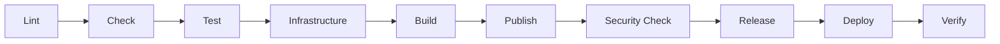
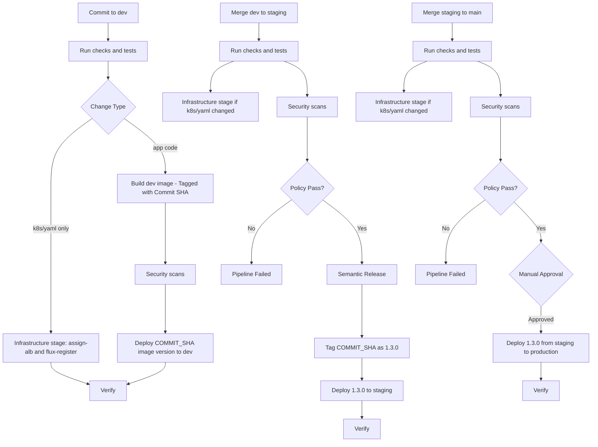

# CI/CD Pipeline Stages & Jobs

This guide explains how Compass CI's GitLab pipeline works, what each stage does, and when jobs are triggered.

## Pipeline Overview

Your application's `.gitlab-ci.yml` orchestrates a multi-stage pipeline that validates, tests, applies infrastructure automation, builds, secures, releases, and deploys your application automatically.

### Pipeline Stages



| Stage | Purpose | Key Jobs | Blocking? |
|-------|---------|----------|-----------|
| **lint** | Validate code quality and format | `lint:commit`, `validate-dockerfile`, `lint:java` | ✅ Yes |
| **check** | Pre-build and manifest validation | `semantic-release-conditions`, `validate-k8s-manifests`, `validate-alb-prerequisites` | ✅ Yes |
| **test** | Run unit/integration tests and code security scans | Language-specific tests, `sast`, `secret_detection`, `code_quality` | ✅ Yes |
| **infrastructure** | Apply GitOps registration and ALB assignment automation | `assign-alb-*`, `flux-register-*` | ✅ Yes |
| **build** | Build images in initial non-prod environments | `build-dev`, `build-testing` | ✅ Yes |
| **publish** | Build versioned artifacts | Uses semantic-release output | ✅ Yes |
| **security-check** | Scan for vulnerabilities | `container_scanning`, `contrast_scanning`, `security-issue-management`, `gciso-policy-evaluation` | ⚠️ Branch dependent |
| **release** | Create version tags and release notes | `semantic-release`, `tag-image` | ✅ Yes (staging/main) |
| **deploy** | Deploy to Kubernetes | `dev-deploy`, `testing-deploy`, `staging-deploy`, `production-deploy` | ✅ Yes |
| **verify** | Confirm deployment health (informational) | `verify-*-deployment` | ⚠️ No (informational only) |

---

## Stage Details

### Lint

**Purpose:** Validate commit messages and code quality before building.

#### `lint:commit`

Validates commit messages follow [Conventional Commits](https://www.conventionalcommits.org/) format.

**Triggers:**
- ✅ Every push to any branch
- ❌ Skipped for merge commits
- ❌ Skipped for release commits (`chore(release):`)

**What it checks:**
```
✅ feat: add user authentication
✅ fix: resolve login timeout issue
✅ docs: update API documentation
❌ Added some stuff
❌ fixed bug
```

**If it fails:** Pipeline stops. You must fix your commit message format.

See: [Commit Message Conventions](./semantic-versioning.md#commit-message-format)

#### `validate-dockerfile`

Uses [hadolint](https://github.com/hadolint/hadolint) to check Dockerfile best practices.

**Triggers:**
- ✅ Only when `Dockerfile` is modified
- ❌ Skipped on release commits

**What it checks:**
- Base image pinned to specific version (not `latest`)
- Proper layer caching (COPY/ADD placement)
- Security best practices (non-root user, minimal packages)

**Result:** `allow_failure: true` - Warns but doesn't block pipeline

---

### Check

#### `semantic-release-conditions`

Pre-flight check to determine if semantic-release will run later.

**Purpose:** Calculate next version number based on commits since last release.

**Triggers:**
- ✅ On `staging` and `main` branches
- ✅ On merge requests targeting these branches
- ✅ On dev/testing for version preview

**Outputs:**
- Next version number
- Whether a release will be created
- Release type (major, minor, patch)

**Example output:**
```
Analyzing commits since v1.2.3...
Found 5 commits: 3 feat, 2 fix
Next version: 1.3.0 (minor release)
```

#### `validate-k8s-manifests`

Scans Kubernetes YAML files for security misconfigurations using [Trivy](https://trivy.dev/).

**Triggers:**
- ✅ Every push to any branch
- ✅ When any file in `k8s/` directory changes

**What it checks:**
- Security context issues (privilege escalation, root user, capabilities)
- Resource configuration (missing limits/requests, probes)
- Image configuration (missing tags, pull policies)
- Network security and RBAC issues
- Sensitive data in ConfigMaps

**Output:** JUnit test report in GitLab's Tests tab

#### `validate-alb-prerequisites`

Validates that Ingress annotations in `k8s/` meet ALB assignment requirements before `assign-alb-*` jobs run.

---

### Test

**Purpose:** Run application-specific tests and code quality checks before deployment.

This stage includes:
- **Unit/Integration Tests** - Your application's test suite
- **SAST** (Static Application Security Testing) - Scans source code for security vulnerabilities
- **Secret Detection** - Detects exposed credentials and secrets in code
- **Code Quality** - Analyzes code complexity and maintainability

#### Application-Specific Tests

Test jobs depend on your language/framework. Examples:

**Java/Gradle:**
```yaml
test:
  stage: test
  image: gradle:8-jdk21
  script:
    - gradle test
```

**Node.js:**
```yaml
test:
  stage: test
  image: node:18
  script:
    - npm ci
    - npm test
```

#### GitLab Default Security Jobs

GitLab automatically includes these security scanning jobs when you include the appropriate templates:

- **`sast`** - Static code analysis (language-specific)
- **`secret_detection`** - Scans for exposed credentials
- **`code_quality`** - Code complexity and duplication analysis

These jobs run automatically via GitLab's managed templates and produce reports visible in merge requests and the Security Dashboard.

**Triggers:** Every pipeline run (all branches)

**If it fails:** Pipeline stops - no deployment occurs

---

### Infrastructure

**Purpose:** Automate Kubernetes ingress ALB group assignment and Flux GitOps registration for app onboarding/self-service workflows.

#### `assign-alb-dev` / `assign-alb-testing` / `assign-alb-staging` / `assign-alb-production`

Reads `k8s/*/ingress.yaml` annotations and assigns the appropriate ALB `group.name` for each environment.

**Triggers:** Environment branch + `k8s/**/*.yml|yaml` changes (and only if `ALB_ASSIGNMENT_ENABLED` is not `false`)

#### `flux-register-dev` / `flux-register-testing` / `flux-register-staging` / `flux-register-production`

Registers or updates app manifests in Flux GitOps (Namespace, GitRepository, Kustomization, SecretStore, ExternalSecret).

Also bootstraps SOPS automatically when `.sops.yaml` is missing (creates `.sops.yaml`, generates keypair, and stores private key in project CI/CD file variable `SOPS_AGE_PRIVATE_KEY`).

**Triggers:**
- Automatic on matching branch when YAML changes are detected
- Manual trigger available on each environment branch

**Why this stage exists:** k8s-only or YAML-only changes are handled here without requiring a container image rebuild.

---

### Build

**Purpose:** Create container images with proper versioning.

#### `build-dev` / `build-testing`

Builds that create **SNAPSHOT** versions for lower environments.

**Image tagging pattern:**
```
${CI_REGISTRY_IMAGE}:${VERSION}-SNAPSHOT
${CI_REGISTRY_IMAGE}:${CI_COMMIT_SHORT_SHA}
```

**Example:**
```
einstein:1.3.0-SNAPSHOT    # Mutable tag, always points to latest
einstein:a1b2c3d            # Immutable commit SHA
```

**Triggers:**
- `build-dev`: On push to `dev` branch when app code changes
- `build-testing`: On push to `testing` branch when app code changes

**Why SNAPSHOT?** Lower environments use mutable tags so you always get the latest build without re-tagging.

#### Standard Build (Staging/Production)

For `staging`, `release`, and `main` branches, images are built with immutable version tags.

**Image tagging pattern:**
```
${CI_REGISTRY_IMAGE}:${VERSION}
${CI_REGISTRY_IMAGE}:${CI_COMMIT_SHORT_SHA}
```

**Example:**
```
einstein:1.3.0             # Immutable release version
einstein:a1b2c3d           # Immutable commit SHA
```

**Build tool:** [Kaniko](https://github.com/chainguard-forks/kaniko) - Builds containers in Kubernetes without Docker daemon

**Artifacts produced:**
- `version.env` - Contains `VERSION` variable for downstream jobs

---

### Publish

**Purpose:** Publish final versioned artifacts after tests pass.

This stage typically re-tags or promotes images built earlier, or builds final production-ready artifacts.

---

### Security-Check

**Purpose:** Scan for vulnerabilities and create GitLab Work items for tracking remediation.

#### `container_scanning` (Trivy)

Scans Docker image for OS and application vulnerabilities.

**Triggers:** All branches

**Scan coverage:**
- OS packages (Alpine, Debian, Ubuntu, etc.)
- Application dependencies (npm, pip, Maven, etc.)
- Known CVEs with severity ratings

**Example output:**
```
Total: 45 vulnerabilities (3 CRITICAL, 12 HIGH, 20 MEDIUM, 10 LOW)
```

**Artifact:** `gl-container-scanning-report.json` - GitLab Security Report format

#### `contrast_scanning`

Runtime application security testing using Contrast Security (if configured).

**Triggers:** All branches (optional, may not be configured for all apps)

**Purpose:** Monitors application at runtime to detect vulnerabilities that only appear during execution

#### `security-issue-management`

**Purpose:** Centralized job that processes ALL security scan results and creates/updates GitLab Work items.

**Waits for:**
- `container_scanning`
- `sast`
- `dependency_scanning`
- `contrast_scanning` (optional)

**What it does:**
1. Reads all `gl-*-report.json` files from previous jobs
2. For each vulnerability:
   - Checks if GitLab Work item already exists (by CVE ID or vulnerability ID)
  - Creates new work item OR updates existing work item
   - Sets due date based on severity:
     - Critical/High: 30 days
     - Medium/Low: 90 days
   - Adds labels: `security`, `vulnerability`, severity labels
   - Links to remediation guidance

**Tracking file:** `vulnerability-tracking.json` (cached between pipeline runs)

**Example GitLab Work item created:**
```
Title: [CRITICAL] CVE-2024-1234 in openssl 1.1.1
Labels: security, vulnerability, critical
Due Date: 2024-03-15 (30 days from detection)

Description:
Vulnerability: CVE-2024-1234
Package: openssl 1.1.1k
Severity: CRITICAL
CVSS Score: 9.8

Affected Image: einstein:1.3.0-SNAPSHOT

Remediation:
Upgrade openssl to version 1.1.1w or later

References:
- https://nvd.nist.gov/vuln/detail/CVE-2024-1234
```

**Pipeline behavior:**
- Dev/Testing: `allow_failure: true` - Warns but doesn't block
- Staging/Production: `allow_failure: false` - Blocks deployment if scan fails

#### `gciso-policy-evaluation`

**Purpose:** Enforces time-based vulnerability remediation policy.

**Policy rules:**
1. Critical/High vulnerabilities > 30 days old: ❌ **FAIL** pipeline
2. Medium vulnerabilities > 90 days old: ❌ **FAIL** pipeline
3. Low vulnerabilities > 90 days old: ⚠️ **WARN** (doesn't block)

**Why time-based?**
- New vulnerabilities don't block immediately (grace period to fix)
- Old vulnerabilities that haven't been addressed are unacceptable
- Encourages regular dependency updates

**Triggers:**
- ✅ Staging branch: Blocks deployment
- ✅ Main branch: Blocks production deployment
- ⚠️ Dev/Testing: Warns only

**If it fails:**
```
❌ Policy Evaluation Failed
Found 2 Critical vulnerabilities older than 30 days:
- CVE-2023-1234 (detected 45 days ago)
- CVE-2023-5678 (detected 60 days ago)

Action Required:
1. Review GitLab Work items: https://gitlab.../work_items?label=vulnerability
2. Update affected dependencies
3. Re-run pipeline after fixes
```

---

### Release

**Purpose:** Create version tags and GitHub-style release notes automatically.

#### `semantic-release`

Uses [semantic-release](https://semantic-release.gitbook.io/) to automatically determine version numbers and create releases.

**Triggers:**
- ✅ On `staging`, `release`, or `main` branch (creates production release version)
- ❌ Skipped on all other branches

**What it does:**
1. Analyzes commits since last release
2. Determines next version (major, minor, patch)
3. Generates CHANGELOG.md
4. Updates package.json with new version
5. Creates Git tag (e.g., `v1.3.0`)
6. Creates GitLab Release with notes
7. Commits changes back to repository

**Example release notes:**
```
# v1.3.0 (2024-02-09)

## Features
* add user authentication (#123)
* implement password reset flow (#125)

## Bug Fixes
* resolve login timeout issue (#124)
* fix dashboard loading spinner (#126)

## Commits
Full diff: v1.2.3...v1.3.0
```

**Versioning rules:**
- `feat:` commit → Minor version bump (1.2.0 → 1.3.0)
- `fix:` commit → Patch version bump (1.2.0 → 1.2.1)
- `BREAKING CHANGE:` → Major version bump (1.2.0 → 2.0.0)

**Artifacts:**
- `version.env` - Contains `VERSION=1.3.0`
- Updated `CHANGELOG.md`
- Updated `package.json`
- Git tag created

See: [Semantic Versioning Guide](./semantic-versioning.md)

#### `tag-image`

Tags the previously built SNAPSHOT image with the final release version.

**Purpose:** Promotes `1.3.0-SNAPSHOT` → `1.3.0` using immutable tag.

**Triggers:**
- ✅ After `semantic-release` creates a Git tag
- ✅ Only on `staging` and `main` branches

**Uses:** [crane](https://github.com/google/go-containerregistry/tree/main/cmd/crane) for efficient image tagging (no re-download/re-push)

**Example:**
```bash
crane tag einstein:1.3.0-SNAPSHOT 1.3.0
```

---

### Deploy

**Purpose:** Deploy container to Kubernetes using Kustomize and Flux CD.

#### `dev-deploy` / `testing-deploy` / `staging-deploy` / `production-deploy`

Deployment jobs that update Flux Kustomization with new image tag.

**How it works:**

1. Checks out [`flux-gitops`](https://medtronic.gitlab-dedicated.com/bcp_web/devops/fluxconfigs/flux-gitops) repository
2. Updates image tag in Kustomization for your app:
   ```yaml
   postBuild:
     substitute:
       image_tag: 1.3.0  # Updated
   ```
3. Commits and pushes to `flux-gitops`
4. Flux CD detects change and deploys to cluster

**Deployment targets:**

| Job | Branch | Environment | Cluster | Namespace |
|-----|--------|-------------|---------|-----------|
| `dev-deploy` | dev | dev | TF-argo-dev | argo-einstein-dev |
| `testing-deploy` | testing | testing | TF-argo-dev | einstein-testing |
| `staging-deploy` | staging | staging | TF-argo-prd | einstein-staging |
| `production-deploy` | main | production | TF-argo-prd | einstein-production |

**Triggers:**
- Dev/Testing: Automatic on push
- Staging: Either automatic OR manual (depending on configuration)
- Production: Usually **manual** - requires human approval

**Manual deployment:**

For production, you typically must click "Play" button in GitLab pipeline UI:


**Environment URLs:**

Each deployment is linked to a GitLab Environment with URL:

- Dev: https://einstein.dev.argo-dev.eks.mdtcloud.io
- Testing: https://einstein.testing.argo-dev.eks.mdtcloud.io
- Staging: https://einstein.staging.argo-prd.eks.mdtcloud.io
- Production: https://einstein.argo-prd.eks.mdtcloud.io

See: [GitLab Environments](./gitlab-environments.md)

**Deployment strategy:** Rolling update (zero-downtime)

Kubernetes gradually replaces old pods with new ones:
```
Old v1.2.0:  ████████░░  (8 pods → 6 pods)
New v1.3.0:  ░░████████  (0 pods → 4 pods)
```

---

### Verify

**Purpose:** Attempt to confirm deployment succeeded and application is healthy.

**Important:** This is an **informational check only** — it does not block deployment. If the verification fails, the deployment may still be successful; the verification job may simply timeout or encounter transient issues (e.g., pods still starting up).

#### `verify-*-deployment`

**What it checks:**
1. Flux Kustomization is synced (no drift)
2. All pods are running (no CrashLoopBackOff)
3. Health check endpoints return HTTP 200:
   - `/health` - Liveness probe
   - `/ready` - Readiness probe
4. Correct image tag is deployed

**Example output (Success):**
```
✅ Flux Kustomization: Synced
✅ Deployment Status: 3/3 pods ready
✅ Health Check: HTTP 200 OK
✅ Image Tag: einstein:1.3.0 (matches expected)

Deployment verified successfully!
```

**Example output (Verification Timeout):**
```
⚠️ Verification Timeout
Pods not yet healthy after 5 minutes

This may be normal if:
- Startup time is longer than expected
- Image pull is taking time
- Pods are still initializing

Manual Verification:
1. Check Grafana for pod and deployment logs: https://g-05c60f9e9b.grafana-workspace.us-east-1.amazonaws.com/
2. Contact support team for further assistance if needed (Infra-Argo-Global)
```

**If you see verification timeout/failure:**

1. **Check application logs in Grafana:**
   - Open [Grafana](https://g-05c60f9e9b.grafana-workspace.us-east-1.amazonaws.com/)
   - Navigate to **Explore → Loki**
   - Query: `{namespace="einstein-production", app="einstein"}`

2. **Check deployment status in Grafana:**
   - Navigate to **Kubernetes / Compute Resources / Namespace (Pods)**
   - Filter by `einstein-production` namespace
   - Verify pod status and restart count

3. **Monitor health in Grafana:**
   - Search for your application's dashboard
   - Verify pods are starting and requests are flowing
   - Check `/health` endpoint response times

4. **Check Flux status:**
   - Verify Flux Kustomization is synced
   - Check if image pull succeeded

**For persistent issues**, contact **Infra-Argo-Global** via ServiceNow.

**Triggers:** After each deployment automatically (non-blocking)

---

## Pipeline Triggers

### When does the pipeline run?

| Event | Pipeline Triggered? | Notes |
|-------|---------------------|-------|
| Push to `dev` | ✅ Yes | Runs checks/tests, infrastructure jobs on YAML changes, then build/deploy on app-code changes |
| Push to `testing` | ✅ Yes | Runs checks/tests, infrastructure jobs on YAML changes, then build/deploy on app-code changes |
| Push to `staging` | ✅ Yes | Runs checks/tests, infrastructure jobs on YAML changes, plus release and deploy flow for app-code changes |
| Push to `main` | ✅ Yes | Runs checks/tests, infrastructure jobs, production release, then production deploy flow |
| Tag created | ✅ Yes | Triggered by semantic-release |
| Manual trigger | ✅ Yes | Via GitLab UI "Run Pipeline" |
| Schedule | ✅ Yes | If configured (e.g., nightly security scans) |

### Branch-specific behavior



---

## Environment-Specific Variables

Each environment has specific variables defined in your `.gitlab-ci.yml`:

```yaml
.dev:
  variables:
    CLUSTER_NAME: TF-argo-dev
    NAMESPACE_NAME: argo-einstein-dev
    BRANCH: dev
    PROMOTION_LEVEL: dev
  environment:
    name: dev
    url: https://einstein.dev.argo-dev.eks.mdtcloud.io
```

These variables control:
- **CLUSTER_NAME**: Which EKS cluster to deploy to
- **NAMESPACE_NAME**: Kubernetes namespace for isolation
- **BRANCH**: Git branch that triggers this environment
- **PROMOTION_LEVEL**: Used by semantic-release
- **environment.name**: Creates GitLab Environment entry
- **environment.url**: Direct link to deployed application

---

## Pipeline Optimization

### Parallel Execution

Jobs in the same stage run in parallel when possible:

**Security-Check Stage:**
```
┌─ container_scanning  ──┐
├─ contrast_scanning     ├─> security-issue-management
├─ ...                   ┘
```

All security scans run simultaneously, then `security-issue-management` processes all results.

### Job Dependencies (`needs`)

Some jobs don't wait for entire stage to complete:

```yaml
security-issue-management:
  needs:
    - job: container_scanning
      artifacts: true
    - job: sast
      artifacts: true
```

This starts as soon as required jobs finish, not when stage finishes.

### Caching

Speed up repeated builds:

```yaml
cache:
  key: vulnerability-tracking
  paths:
    - vulnerability-tracking.json
```

Persists vulnerability tracking across pipeline runs to avoid duplicate GitLab Work items.

---

Pipeline customization examples are documented in [Pipeline Customization](./pipeline-customization.md).

---

## Troubleshooting Pipeline Issues

### Pipeline won't start

**Check:**
1. GitLab Runner available? (Settings > CI/CD > Runners)
2. `.gitlab-ci.yml` syntax valid? (Build > Pipeline editor)
3. Protected branches configured? (Settings > Repository > Protected Branches)

### Build fails

**Check:**
1. Dockerfile syntax valid?
2. Base image accessible from Artifactory?
3. Build logs for specific error

### Tests fail

**Check:**
1. Dependencies installed correctly?
2. Test configuration matches environment?
3. Test logs for specific failures

### Security scans block deployment

**Check:**
1. GitLab Work items created for vulnerabilities?
2. Are vulnerabilities > 30 days old (Critical/High)?
3. Review `gciso-policy-evaluation` job output

### Deployment fails

**Check:**
1. Flux Kustomization status in cluster
2. Pod status in Grafana **Kubernetes / Compute Resources / Namespace (Pods)** dashboard
3. Application logs in Grafana **Explore → Loki**
4. Health check endpoints responding?

**For assistance**, contact **Infra-Argo-Global** via ServiceNow.

---

## Next Steps

[!ref icon="rocket" text="Semantic Versioning & Commit Conventions"](./semantic-versioning.md)

[!ref icon="code" text="Pipeline Customization"](./pipeline-customization.md)

[!ref icon="server" text="Kubernetes Validation"](./kubernetes-validation.md)

[!ref icon="shield" text="Security Issue Management"](./security-gitlab-issues.md)

[!ref icon="rocket" text="GitLab Environments"](./gitlab-environments.md)

[!ref icon="bug" text="Troubleshooting Pipelines"](../troubleshooting-and-support/troubleshooting-guide.md)
