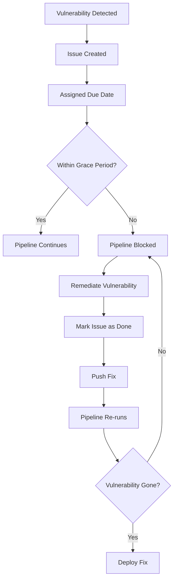

# Security Vulnerabilities & GitLab Work items

Every pipeline run automatically scans your application and container image for vulnerabilities. Security issues are tracked as GitLab Work items with defined remediation timelines based on severity.

## How It Works

The pipeline runs multiple security scanners:
- **Container Scanning (Trivy)** - Scans Docker image for OS and application vulnerabilities
- **SAST** - Analyzes source code for security issues (SQL injection, XSS, hardcoded secrets, etc.)
- **Dependency Scanning** - Checks application dependencies for known vulnerabilities
- **Contrast Security** - Runtime security analysis (required when supported by your app language; see [supported languages](https://docs.contrastsecurity.com/en/get-started-agent-installation.html))

All vulnerabilities are automatically converted to GitLab Work items with:
- **Severity labels** (critical, high, medium, low)
- **Due dates** - 30 days for critical/high, 90 days for medium/low
- **Remediation guidance** - Details on how to fix the issue

---

## Due Dates & Blocking Rules

The remediation timelines and blocking rules are based on [Medtronic's Application Security Testing standards (GCISO)](https://medtronic.sharepoint.com/sites/GSO/SitePages/Application-Security-Testing.aspx#how-to-address-application-security-findings). These requirements are organization-wide and apply to all applications on Compass CI.

**Your application's blocking behavior depends on its data classification.** Specify your data classification as a CI/CD variable in your pipeline:

```yaml
variables:
  DATA_CLASSIFICATION: HIGHLY_SENSITIVE  # Options: HIGHLY_SENSITIVE, SENSITIVE, INTERNAL_USE_ONLY, PUBLIC
```

!!!info Determining Your Data Classification
Your `DATA_CLASSIFICATION` value should be determined through Medtronic's official Security and Privacy Intake Request process. Complete the [Security and Privacy Intake Request Form](https://medtronicprod.service-now.com/it/?id=sc_cat_item_order_guide&sys_id=10bd221adb726c1014c354f94896192d) to receive an official classification assessment for your application.

**If your application's data handling changes:**
- Complete a new intake request to reassess your classification level
- Update the `DATA_CLASSIFICATION` variable in your `.gitlab-ci.yml`
- The pipeline will automatically adjust vulnerability due dates and blocking rules for existing issues

[!ref Learn more about determining your classification](../getting-started/gitlab-repository-configuration.md#determining-your-data-classification)
!!!

### Vulnerability Reporting & Remediation Requirements

**All vulnerabilities are scanned and reported as GitLab Work items** for visibility and tracking. Remediation requirements are based on your application's data classification per [GCISO Application Security Testing standards](https://medtronic.sharepoint.com/sites/GSO/SitePages/Application-Security-Testing.aspx).

**For HIGHLY_SENSITIVE applications:**
All vulnerabilities (Critical, High, Medium, Low) are tracked with due dates and require remediation or a Policy Exception Request before deploying to production.

| Severity | Due Date |
|----------|----------|
| **Critical** | 30 days |
| **High** | 30 days |
| **Medium** | 90 days |
| **Low** | 90 days |

**For SENSITIVE, INTERNAL_USE_ONLY, or PUBLIC applications:**
All vulnerabilities are scanned and reported. Only Critical, High, and Medium severity issues have remediation due dates. Low severity issues are tracked but have no due date and do not block deployments.

| Severity | Due Date |
|----------|----------|
| **Critical** | 30 days |
| **High** | 30 days |
| **Medium** | 90 days |
| **Low** | None |

!!!danger Vulnerabilities Not Remediated by Due Date
If a vulnerability is not remediated by its due date, you must submit a **Policy Exception Request (PER)** in LogicGate to deploy to staging, release, or production environments. See [Policy Exception Requests](../security/policy-exception-request.md) for step-by-step instructions.
!!!

## Remediating Vulnerabilities

### Review Issues

Navigate to: **Project > Plan > Work items**

### Use GitLab Built-in Security Views

Use GitLab's built-in security pages for portfolio-level and project-level visibility:

- **Security Dashboard**: **Secure > Security Dashboard**
- **Vulnerability Report**: **Secure > Vulnerability Report**

Reference documentation:
- [GitLab Security Dashboard](https://docs.gitlab.com/user/application_security/security_dashboard/)
- [GitLab Vulnerability Report](https://docs.gitlab.com/user/application_security/vulnerability_report/)

### Check Your Data Classification

Your application's vulnerability remediation requirements depend on its `DATA_CLASSIFICATION`:

- **Is your app HIGHLY_SENSITIVE?** You must remediate all vulnerabilities (Critical, High, Medium, AND Low) by their due dates. No exceptions for Low severity.
- **Other classifications (SENSITIVE, INTERNAL_USE_ONLY, PUBLIC)?** All vulnerabilities are scanned and reported. Only Critical, High, and Medium have due dates. Low severity issues are tracked but never block deployments and don't require action.

If you're not sure your DATA_CLASSIFICATION is set, check your `.gitlab-ci.yml` file for the `DATA_CLASSIFICATION` variable. If missing, contact your platform team.

### Prioritize

Sort issues by **Due Date** (earliest first). Critical and high-severity vulnerabilities should be addressed immediately to avoid imminent pipeline failures.

### Handle Unfixed Vulnerable Libraries

For vulnerable libraries with no available patch, follow this priority:

1. **If the library is not used** → Remove it from your project
2. **If the library is no longer maintained** (not regularly patched) → Remove it
3. **If the library is used AND maintained** (but no patch available) → Document via Policy Exception Request and monitor for patches

For step 3, when a patch becomes available, update within the timeline based on severity (higher severity = shorter timeline).

See [GCISO Remediation Resources](https://medtronic.sharepoint.com/sites/GSO/SitePages/Remediation-Resources.aspx) for additional guidance on handling vulnerable dependencies.

### Fix the Vulnerability

Depending on the vulnerability type:

**OS Package vulnerabilities (Dockerfile):**
```dockerfile
# Update in your Dockerfile
RUN apk add --no-cache openssl=1.1.1w-r0  # Pin specific version
```

**Application dependencies (Maven/pom.xml):**
```xml
<dependency>
    <groupId>com.fasterxml.jackson.core</groupId>
    <artifactId>jackson-databind</artifactId>
    <version>2.14.0</version>  <!-- Update to fixed version -->
</dependency>
```

**Application dependencies (npm/package.json):**
```bash
npm update lodash@latest
```

**SAST issues (code vulnerabilities):**
- Review the exact issue location provided in the GitLab Work item
- Implement the suggested fix (e.g., use parameterized queries instead of string concatenation)

**Contrast Security issues:**
- Review the issue details in GitLab and in your Contrast dashboard
- Mark the issue as **Remediated** in Contrast when you apply the fix
- Contrast will communicate the remediation status back to the pipeline

### Updating Issue Status

As you work on remediation:
- **Add comments** to the GitLab Work item with your progress
- **Link related merge requests** to the issue
- **For Contrast items:** Ensure you mark them resolved in Contrast as well - the platform will track status from both systems
- **Close the issue** once the vulnerability has been remediated

!!!warning Keep Vulnerability Status Updated for Risk Score
If a future scan shows the vulnerability is fixed, make sure the item is marked as **Resolved** in GitLab's **Vulnerability Report**. If it stays in a non-resolved state, it can still be counted in your project's **Risk Score**.
!!!

### Commit & Push
Use a [Conventional Commits](https://www.conventionalcommits.org/en/v1.0.0/#summary) style commit message to mention the fix and automatically trigger a new pipeline.

```bash
git commit -m "fix: upgrade openssl to 1.1.1w (resolves CVE-2024-1234)"
git push origin dev
```

### Pipeline Re-scans

The pipeline runs security scans again when you push your fix. The scan results determine whether the vulnerability is actually remediated:

- **Vulnerability no longer detected** → Issue will remain closed
- **Vulnerability still detected** → Issue will be automatically re-opened

---

## Policy Exceptions (When You Can't Fix It)

Sometimes you cannot remediate a vulnerability immediately:
- Upstream hasn't released a patch yet
- Fixing would break critical functionality
- You need time to validate a complex fix

**For comprehensive guidance on submitting a policy exception request, see [Policy Exception Requests](../security/policy-exception-request.md).**

The process is straightforward:

1. Export your vulnerabilities as CSV from **Project > Work items** (filter by **Label: vulnerability**)
2. Document for each vulnerability: Why it can't be fixed by the due date, compensating controls in place, and proposed remediation date
3. Submit a PER in [LogicGate](https://medtronic.logicgate.com) with the CSV attachment and business justification
4. Once approved, add the `PER::<PER-ID>` label to each corresponding GitLab Work item

See [Policy Exception Requests](../security/policy-exception-request.md) for step-by-step instructions, templates, and examples.

---

## Best Practices

### Regular Dependency Updates

**Schedule regular dependency update sprints:**
- Monthly: Review and update dependencies
- Quarterly: Major version upgrades
- As needed: Security patches

**Use automated tools:**
- Renovate bot for dependency updates
- Dependabot for GitHub-hosted dependencies

### Proactive Monitoring

**Don't wait for pipelines to fail:**
- Review vulnerability issues weekly
- Address critical/high issues immediately
- Plan medium/low fixes in regular sprints

### Communication

**Keep issues updated:**
- Comment on progress
- Link to related PRs
- Document decisions (e.g., "waiting for upstream fix")

### Base Image Updates

**Keep base images current:**
```dockerfile
# Pin to specific digest for reproducibility
FROM alpine:3.18@sha256:abc123...

# But regularly update to latest 3.18.x patch version
```

---

## Troubleshooting

### Issues not being created

**Check:**
1. `security-issue-management` job succeeded?
2. `SECURITY_ISSUE_TOKEN` variable configured with `api` scope?
3. Token owner (project/group bot or access token) has "Developer" role or higher on the target project?

**Fix:** Verify GitLab access token permissions and use project/group access tokens instead of legacy shared service-account users.

### Duplicate issues created

**Check:**
1. `vulnerability-tracking.json` cached correctly?
2. Cache not cleared between pipelines?

**Fix:** Ensure cache configuration is correct:
```yaml
cache:
  key: vulnerability-tracking
  paths:
    - vulnerability-tracking.json
```

### Policy evaluation fails incorrectly

**Check:**
1. `vulnerability-tracking.json` has correct detected dates?
2. System time on runner is correct?

**Fix:** Review tracking file dates, correct if necessary.

### Too many false positives

**Check:**
1. Trivy database up to date?
2. Are there known false positives for your stack?

**Fix:** Configure Trivy to ignore false positives:
```yaml
# .trivyignore
CVE-2024-1234  # False positive - package not actually used
```

---

## Quick Reference

### Issue Workflow



### Severity & Due Dates

| Severity | CVSS Range | Due Date | Pipeline Block |
|----------|------------|----------|----------------|
| Critical | 9.0-10.0 | 30 days | ✅ Yes (staging/release/production) |
| High | 7.0-8.9 | 30 days | ✅ Yes (staging/release/production) |
| Medium | 4.0-6.9 | 90 days | ✅ Yes (staging/release/production) |
| Low | 0.1-3.9 | None* | Varies by classification |

*Low severity: No due date for SENSITIVE, INTERNAL_USE_ONLY, or PUBLIC; 90 days for HIGHLY_SENSITIVE

---

## Next Steps

[!ref icon="workflow" text="Pipeline Stages & Jobs"](./pipeline-stages.md)

[!ref icon="rocket" text="Semantic Versioning"](./semantic-versioning.md)

[!ref icon="shield" text="Security Best Practices"](../security/index.md)

[!ref icon="zap" text="Policy Exception Requests"](../security/policy-exception-request.md)
