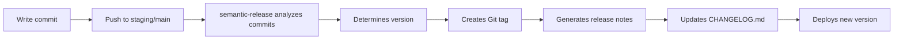
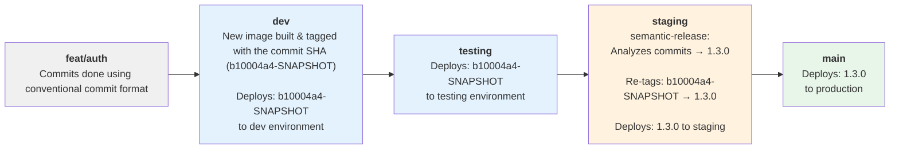

# Semantic Versioning & Commit Conventions

Compass CI uses **automated semantic versioning** based on your commit messages. Write commits correctly, and versioning happens automatically—no manual tagging required.

## What is Semantic Versioning?

[Semantic Versioning (SemVer)](https://semver.org/) uses a three-part version number:

```
MAJOR.MINOR.PATCH
  │     │     │
  │     │     └─ Bug fixes (backward compatible)
  │     └─────── New features (backward compatible)
  └───────────── Breaking changes (NOT backward compatible)
```

**Examples:**
- `1.2.3` → `1.2.4` - Bug fix (patch)
- `1.2.3` → `1.3.0` - New feature (minor)
- `1.2.3` → `2.0.0` - Breaking change (major)

---

## How Compass CI Versions Your App

### The Automatic Flow



**You write:**
```bash
git commit -m "feat: add password reset feature"
git push origin main
```

**semantic-release automatically:**
1. Analyzes: "This is a new feature (feat:)"
2. Determines: "Bump minor version: 1.2.3 → 1.3.0"
3. Creates: Git tag `1.3.0`
4. Generates: Release notes from commit messages
5. Updates: `CHANGELOG.md` and `package.json` & commits automatically to the repo
6. Deploys: Version 1.3.0 to production

**No manual version bumps. No manual release notes. Fully automated.**

---

## Commit Message Format

Compass CI requires [Conventional Commits](https://www.conventionalcommits.org/) format:

###  Basic Structure

```
<type>(<scope>): <subject>

<body>

<footer>
```

**Required:**
- `<type>`: What kind of change (see types below)
- `: ` - Colon and space after type
- `<subject>`: Brief description (lowercase, no period at end)

**Optional:**
- `(<scope>)`: Area of codebase affected
- `<body>`: Detailed explanation (separate with blank line)
- `<footer>`: Breaking changes or issue references

### Commit Types

| Type | Version Bump | Purpose | Example |
|------|--------------|---------|---------|
| `feat` | ⬆️ **MINOR** | New feature | `feat: add two-factor authentication` |
| `fix` | ⬆️ **PATCH** | Bug fix | `fix: resolve login timeout after 5 minutes` |
| `docs` | ❌ None | Documentation only | `docs: update API authentication guide` |
| `style` | ❌ None | Code formatting (no logic change) | `style: fix indentation in UserService` |
| `refactor` | ❌ None | Code restructuring (no behavior change) | `refactor: extract validation into separate class` |
| `perf` | ⬆️ **PATCH** | Performance improvement | `perf: optimize database query for user search` |
| `test` | ❌ None | Adding/updating tests | `test: add unit tests for authentication` |
| `build` | ❌ None | Build system or dependencies | `build: upgrade gradle to 8.5` |
| `ci` | ❌ None | CI/CD configuration | `ci: add deployment verification step` |
| `chore` | ❌ None | Maintenance tasks | `chore: update copyright year` |
| `revert` | Depends | Reverting a previous commit | `revert: feat: add two-factor authentication` |

### Breaking Changes

To indicate a breaking change (major version bump), use:

**Option 1: Add `!` after type**
```
feat!: remove deprecated login API endpoint
```

**Option 2: Add `BREAKING CHANGE:` footer**
```
feat: redesign authentication flow

BREAKING CHANGE: The /api/v1/login endpoint has been removed.
Use /api/v2/auth/login instead.
```

**Result:** Version bumps from `1.2.3` → `2.0.0`

---

## Examples

### ✅ Valid Commit Messages

**Simple feature:**
```
feat: add password strength indicator
```

**Bug fix with scope:**
```
fix(auth): resolve session timeout issue
```

**Feature with details:**
```
feat: implement user profile page

- Add profile editing form
- Include avatar upload
- Display user activity history
```

**Breaking change:**
```
feat!: upgrade to new authentication API

BREAKING CHANGE: Removed support for legacy /auth/login endpoint.
All clients must update to use /api/v2/auth/login.

Migration guide: https://docs.example.com/auth-migration
```

**Bug fix referencing issue:**
```
fix: prevent duplicate email notifications

Closes #456
```

### ❌ Invalid Commit Messages

```
Added new feature              # Missing type
feat add login                 # Missing colon after type
Feat: Add Login               # Type should be lowercase
feat: Add login.              # Subject shouldn't end with period
feature: add login            # Wrong type (use 'feat' not 'feature')
```

---

## Version Calculation Examples

### Scenario 1: Simple Feature

**Starting version:** `1.2.3`

**Commits since last release:**
```
feat: add password reset
docs: update API documentation
```

**semantic-release determines:**
- `feat` commit → Minor version bump
- `docs` commit → No version bump

**New version:** `1.3.0`

---

### Scenario 2: Multiple Features and Fixes

**Starting version:** `1.3.0`

**Commits since last release:**
```
feat: add user profile page
feat: implement search functionality
fix: resolve dashboard loading issue
fix: correct timezone display
docs: update deployment guide
```

**semantic-release determines:**
- 2× `feat` commits → Minor version bump (doesn't matter how many feat commits)
- 2× `fix` commits → Patch version bump (overridden by minor bump)
- Highest bump wins → **Minor**

**New version:** `1.4.0`

---

### Scenario 3: Breaking Change

**Starting version:** `1.4.0`

**Commits since last release:**
```
feat: add new authentication flow
feat!: remove legacy API endpoints
fix: resolve CORS issue
```

**semantic-release determines:**
- `feat!` → Breaking change → Major version bump
- Other commits ignored (major bump takes precedence)

**New version:** `2.0.0`

---

### Scenario 4: Only Bug Fixes

**Starting version:** `2.0.0`

**Commits since last release:**
```
fix: resolve memory leak in background job
fix: correct date formatting
```

**semantic-release determines:**
- Only `fix` commits → Patch version bump

**New version:** `2.0.1`

---

### Scenario 5: No Version Bump

**Starting version:** `2.0.1`

**Commits since last release:**
```
docs: update README
chore: upgrade dependencies
ci: add parallel test execution
```

**semantic-release determines:**
- No `feat` or `fix` commits → **No release created**

**Version remains:** `2.0.1`

---

## Configuration Files

### `.releaserc.json`

Configures semantic-release behavior for your project:

```json
{
  "branches": [
    "staging",
    {
      "name": "main",
      "prerelease": false
    }
  ],
  "tagFormat": "${version}",
  "plugins": [
    "@semantic-release/commit-analyzer",
    "@semantic-release/gitlab",
    "@semantic-release/release-notes-generator",
    ["@semantic-release/npm", { "npmPublish": false }],
    ["@semantic-release/changelog", { "changelogFile": "CHANGELOG.md" }],
    [
      "@semantic-release/git",
      {
        "assets": ["CHANGELOG.md", "package.json"],
        "message": "chore(release): ${nextRelease.version}"
      }
    ],
    [
      "@semantic-release/exec",
      { "verifyReleaseCmd": "echo VERSION=${nextRelease.version} >> version.env" }
    ]
  ]
}
```

**Key settings:**

| Setting | Purpose |
|---------|---------|
| `branches` | Which branches create releases (staging, main) |
| `tagFormat` | How Git tags are formatted (`v1.3.0` vs `1.3.0`) |
| `commit-analyzer` | Reads commits and determines version |
| `release-notes-generator` | Creates release notes from commits |
| `changelog` | Updates CHANGELOG.md |
| `git` | Commits version changes back to repo |
| `exec` | Exports VERSION for pipeline jobs |

### `commitlint.config.js`

Validates commit messages in CI pipeline:

```javascript
module.exports = {
  extends: ['@commitlint/config-conventional'],
  rules: {
    'type-enum': [
      2,
      'always',
      [
        'feat',
        'fix',
        'docs',
        'style',
        'refactor',
        'perf',
        'test',
        'build',
        'ci',
        'chore',
        'revert'
      ]
    ]
  }
};
```

This configuration is used by the `lint:commit` pipeline job to enforce proper commit format.

---

## Development Branches

Development branches (`dev` and `testing`) are where developers test changes early. These branches **do not run semantic-release** and instead use snapshot tags for early validation.

### Feature Branches

**Purpose:** Developer work-in-progress

**Workflow:**
- Developer creates feature branch from `dev` (e.g., `feat/auth-flow`, `fix/login-timeout`)
- Writes commits using Conventional Commits format
- Pushes to repository

**Example commits:**
```
feat: add two-factor authentication
fix: resolve session timeout
docs: update authentication guide
```

These commits become the **commit messages** that semantic-release will later analyze when you promote to `staging` or `main`.

### `dev` Branch

**Purpose:** First integration point; continuous early testing

**Image tagging:** `commit-sha-SNAPSHOT` (e.g., `myapp:b10004a4-SNAPSHOT`)

**Behavior:**
- Receives merged commits from feature branches
- Pipeline builds new image and tags it with the commit SHA + `-SNAPSHOT`
- Image pushed to registry
- Deployed to dev environment for testing
- **No semantic-release runs** — keeps SNAPSHOT tag throughout

**Flow:**
```
Merge feat/auth → dev branch
  ↓
Pipeline builds image: myapp:b10004a4-SNAPSHOT
  ↓
Deploys: myapp:b10004a4-SNAPSHOT to dev environment
```

### `testing` Branch

**Purpose:** Secondary testing environment; verifies stability

**Image tagging:** Same SNAPSHOT tag from `dev` (e.g., `myapp:b10004a4-SNAPSHOT`)

**Behavior:**
- Receives commits from `dev` branch
- **Redeploys the same SNAPSHOT image** (no rebuild needed)
- No semantic-release — still using SNAPSHOT tag
- Cross-team testing and validation occurs here

**Flow:**
```
Merge dev → testing branch
  ↓
Redeploys: myapp:b10004a4-SNAPSHOT to testing environment
  ↓
(Same artifact, different environment)
```

### Why SNAPSHOT Tags?

SNAPSHOT tags allow you to:
- **Test early** without versioning
- **Iterate quickly** with the same immutable commit SHA
- **Delay versioning** until you're ready to promote to staging/production
- **Keep lower environments decoupled** from release versioning

Once you merge to `staging` or `main`, semantic-release calculates a proper version and re-tags the artifact—but until then, the SNAPSHOT tag keeps things simple.

---

## Release Branches

semantic-release runs on specific branches:

### `staging` or `release` Branch

**Purpose:** Pre-release testing

**Behavior:**
- Creates new release version from the commit SHA in the `dev` or `testing` branch (whichever the change was merged from)

**Example flow:**



### `main` Branch

**Purpose:** Production releases

**Version format:** `1.3.0` (no suffix)

**Behavior:**
- Creates final production releases
- Tags with clean version number
- Deploys to production environment

## Image Re-tagging Across Environments

When you merge commits from lower environments (`dev` or `testing`) to higher environments (`staging` or `main`), the pipeline automatically re-tags the previously built container image with the new semantic-release version number.

### How It Works

1. **Initial Build (dev/testing):**
   - The `publish` stage in dev/testing builds your image and tags it with the commit SHA: `myapp:b10004a4-SNAPSHOT`
   - This exact image is pushed to your container registry
   - It deploys to dev and testing environments as-is

2. **Promotion to Higher Environment:**
   - You merge from `dev`/`testing` branch to `staging` or `main`
   - semantic-release analyzes the commit messages and calculates the new version (e.g., `1.3.0`)

3. **Automatic Re-tagging (NOT Re-building):**
   - The `tag-image` job pulls the **already-built image** from the registry using the original commit SHA tag
   - It creates a new tag for that same image: `myapp:1.3.0-rc.1` (staging) or `myapp:1.3.0` (main)
   - **The image binary is identical** — no rebuild, no compilation, no tests re-run
   - The re-tagged image is pushed back to the registry

4. **Deployment:**
   - The `deploy` stage deploys the re-tagged image to the target environment
   - You're deploying the **exact same artifact** that passed testing in dev/testing, just with a new semantic version tag

**Key benefit:** By re-tagging instead of rebuilding, you ensure **bit-for-bit identical** deployments across all environments. What was tested in dev is guaranteed to be the same code running in production.

### Example

```
Developer pushes to dev branch
  ↓
Build stage creates: myapp:1.3.0-SNAPSHOT
  ↓
Dev deployment succeeds
  ↓
Developer creates merge request: dev → staging
  ↓
Merge accepted, commits land on staging branch
  ↓
semantic-release calculates version: 1.3.0-rc.1
  ↓
tag-image job re-tags: myapp:1.3.0-SNAPSHOT → myapp:1.3.0-rc.1
  ↓
Staging deployment pulls and deploys: myapp:1.3.0-rc.1
  ↓
Merge accepted: staging → main
  ↓
semantic-release calculates version: 1.3.0 (final)
  ↓
tag-image job re-tags: myapp:1.3.0-rc.1 → myapp:1.3.0
  ↓
Production deployment pulls and deploys: myapp:1.3.0
```

This approach keeps your artifact immutable and traceable—the same application binary promoted across environments, just with semantically versioned tags at each stage.

---

## GitLab Releases & Tags

semantic-release **automatically creates Git tags and GitLab Releases** with every version. You don't need to create these manually.

### Viewing Tags

Navigate to: **Code > Tags**

You'll see all version tags created by semantic-release:

```
1.3.0    Latest version
1.2.3    Previous release
1.2.2    Earlier release
...
```

Each tag shows:
- Version number (e.g., `1.3.0`)
- Commit it points to
- Release date

### Viewing Releases

Navigate to: **Deploy > Releases**

This shows full release details including:

- **Release notes** - Auto-generated from commit messages
- **Version number** - Corresponds to Git tag
- **Deployment status** - Which environments have this version
- **Release date** - When it was created
- **Assets/Artifacts** - Any build artifacts attached

### Automatic Release Notes

semantic-release automatically creates release notes with:

Organized by commit type:

```markdown
# 1.3.0 (2024-02-09)

## Features

* add two-factor authentication (#123)
* implement password reset flow (#125)
* add user activity dashboard (#127)

## Bug Fixes

* resolve session timeout after 5 minutes (#124)
* fix timezone display in reports (#126)

## Performance Improvements

* optimize database queries for user search (#128)

---

**Full Changelog**: https://gitlab.../compare/1.2.3...1.3.0
```

**Included in release notes:**
- **Features** - All `feat:` commits
- **Bug Fixes** - All `fix:` commits
- **Performance** - All `perf:` commits
- **Breaking Changes** - Highlighted prominently
- **Full diff link** - Compare old and new versions

### Issue Linking

Reference GitLab work items in commits, and they'll appear in release notes:

```
feat: add user dashboard

Implements user story from #123
Closes #124
Related to #125
```

Release notes will link directly to these issues.

---

## Version in GitLab Environments

Once a version is released, it appears in **GitLab > Operate > Environments**:


**Shows:**
- Environment name (dev, staging, production)
- Current deployed version (`1.3.0`)
- Deployment status
- Direct link to application
- Rollback options

See: [GitLab Environments Guide](./gitlab-environments.md)

---

## CHANGELOG.md

semantic-release automatically maintains a changelog file:

```markdown
# Changelog

## [1.3.0](https://gitlab.../compare/1.2.3...1.3.0) (2024-02-09)

### Features

* add two-factor authentication ([abc1234](https://gitlab.../commit/abc1234))
* implement password reset flow ([def5678](https://gitlab.../commit/def5678))

### Bug Fixes

* resolve session timeout issue ([ghi9012](https://gitlab.../commit/ghi9012))

## [1.2.3](https://gitlab.../compare/1.2.2...1.2.3) (2024-02-01)

### Bug Fixes

* fix memory leak in background job ([jkl3456](https://gitlab.../commit/jkl3456))
```

**Benefits:**
- Automatically updated on every release
- Links to commits and diffs
- Committed to repository (visible to all)
- Follows [Keep a Changelog](https://keepachangelog.com/) format

---

## Best Practices

### Writing Good Commit Messages

**Do:**
- ✅ Use imperative mood: "add feature" not "added feature"
- ✅ Be specific: "fix login timeout" not "fix bug"
- ✅ Use lowercase for subject
- ✅ Reference issues where relevant
- ✅ Explain **why** in the body, not just **what**

**Don't:**
- ❌ Use generic messages: "fix stuff", "update code"
- ❌ Mix multiple unrelated changes in one commit
- ❌ Include code review comments in commits
- ❌ Use vague descriptions

### Atomic Commits

**One logical change per commit:**

✅ Good:
```
feat: add password strength validation
feat: add password reset email
feat: add password history tracking
```

❌ Bad:
```
feat: add password features

- Add strength validation
- Add reset email
- Add history tracking
- Fix login bug
- Update documentation
```

### When to Use Scopes

Scopes help categorize changes in large projects:

```
feat(auth): add OAuth support
feat(api): add pagination to user list endpoint
fix(ui): resolve button alignment issue
fix(db): add missing index on users table
```

**Recommended scopes by component:**
- `auth` - Authentication/authorization
- `api` - API endpoints
- `ui` - User interface
- `db` - Database changes
- `config` - Configuration
- `deps` - Dependencies

---

## Troubleshooting

### semantic-release won't create a release

**Check:**
1. Are you on `staging` or `main` branch?
2. Do you have `feat:` or `fix:` commits since last release?
3. Check `semantic-release-conditions` job output to see why

### Wrong version number created

**Check:**
1. Review commits since last release
2. Verify commit message format
3. Check if breaking changes were properly marked

### Can't push to repository

**Error:**
```
remote: GitLab: You are not allowed to push code to protected branches
```

**Fix:** The `semantic-release` bot needs write access to protected branches.

1. Go to **Settings > Repository > Protected Branches**
2. Find `main` and `staging` branches
3. Add `svc-ws-git` user with "Maintainer" role

### Duplicate releases created

If semantic-release runs twice, you might get duplicate tags.

**Prevention:**
- Don't manually create tags that conflict
- Ensure only one pipeline runs per commit
- Check for pipeline conflicts in GitLab

---

## Migration from Manual Versioning

### If you currently version manually

**Before (manual):**
```bash
# Developer manually updates version
vi package.json  # Change 1.2.3 → 1.3.0
git commit -m "Bump version to 1.3.0"
git tag v1.3.0
git push --tags
```

**After (automated):**
```bash
# Developer writes descriptive commit
git commit -m "feat: add user dashboard"
git push origin main

# semantic-release automatically:
# - Determines version (1.2.3 → 1.3.0)
# - Creates tag
# - Generates release notes
# - Updates CHANGELOG
```

**Benefits of automation:**
- No human error in version numbers
- Consistent versioning across all projects
- Automatic release notes
- Version reflects actual changes (not arbitrary)

---

## Advanced Topics

### Custom Release Rules

You can customize which commit types trigger releases:

```json
{
  "plugins": [
    [
      "@semantic-release/commit-analyzer",
      {
        "releaseRules": [
          { "type": "docs", "release": "patch" },
          { "type": "refactor", "release": "patch" }
        ]
      }
    ]
  ]
}
```

### Skipping Releases

To commit without creating a release:

```bash
git commit -m "chore: update dependencies [skip release]"
```

Or use commit types that don't trigger releases (`docs`, `chore`, `ci`).

---

## Quick Reference

### Commit Message Cheat Sheet

```bash
# New feature (minor version bump)
git commit -m "feat: add user profile page"

# Bug fix (patch version bump)
git commit -m "fix: resolve login timeout"

# Breaking change (major version bump)
git commit -m "feat!: redesign authentication API"

# No version bump
git commit -m "docs: update README"
git commit -m "chore: upgrade dependencies"
git commit -m "ci: add new pipeline job"

# With scope
git commit -m "feat(auth): add OAuth support"

# With issue reference
git commit -m "fix: resolve dashboard crash\n\nCloses #123"
```

### Version Bump Decision Tree

```
Is there a breaking change?
├─ Yes → Major version (1.0.0 → 2.0.0)
└─ No
   ├─ Is there a new feature (feat)?
   │  └─ Yes → Minor version (1.2.0 → 1.3.0)
   └─ No
      ├─ Is there a bug fix (fix)?
      │  └─ Yes → Patch version (1.2.3 → 1.2.4)
      └─ No → No release
```

---

## Next Steps

[!ref icon="workflow" text="Pipeline Stages & Jobs"](./pipeline-stages.md)

[!ref icon="rocket" text="GitLab Environments"](./gitlab-environments.md)

[!ref icon="shield" text="Security & GitLab Work items"](./security-gitlab-issues.md)

[!ref icon="zap" text="Example Project: Einstein"](https://medtronic.gitlab-dedicated.com/bcp_web/common/einstein)
