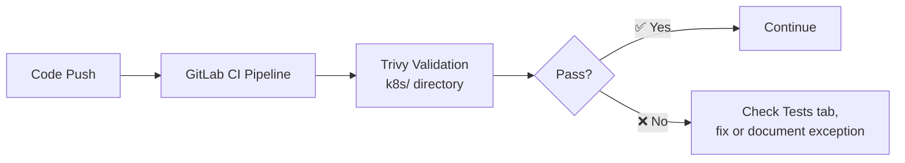
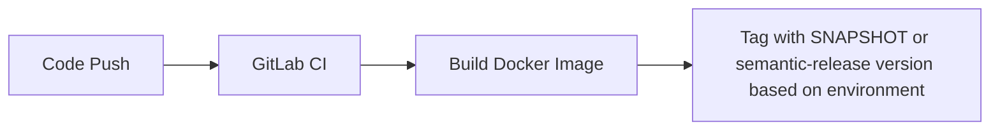
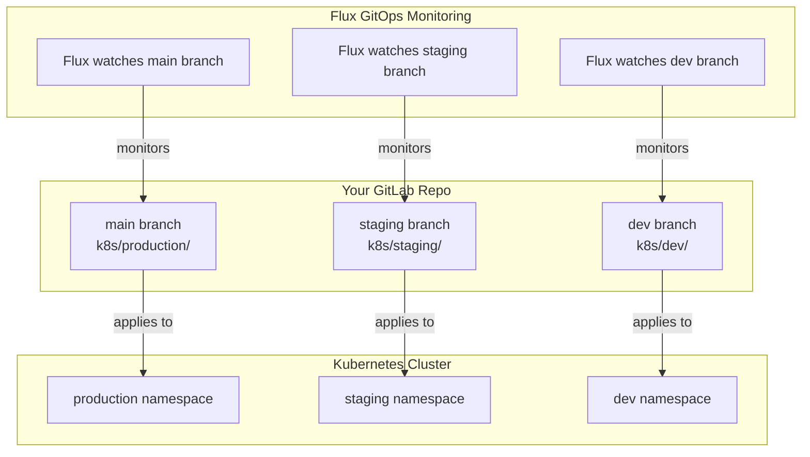
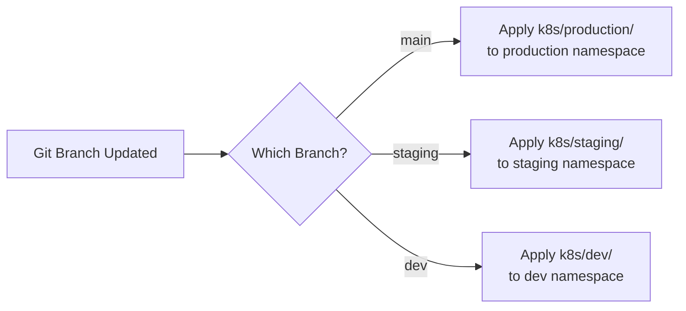
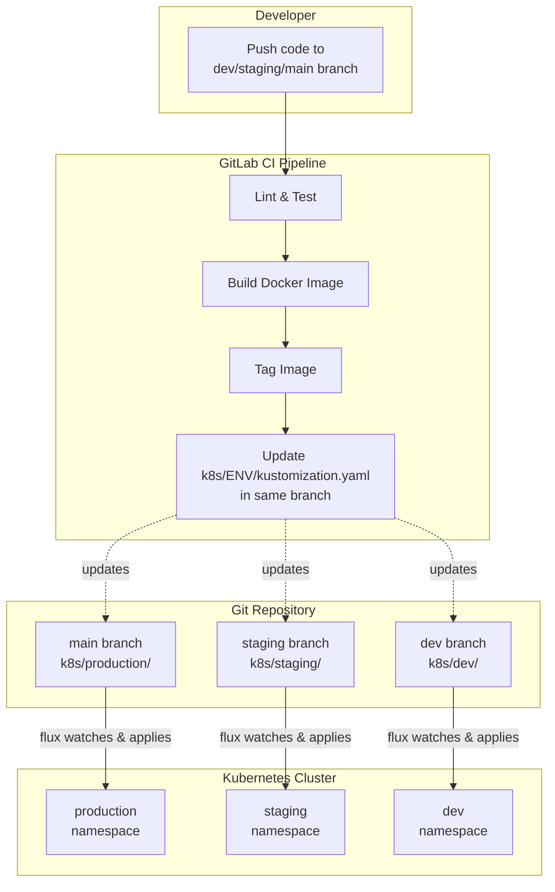

# Kubernetes Manifests

Configure your application deployment using Kubernetes manifests organized with Kustomize.

## What Are Kubernetes Manifests?

Kubernetes manifests are YAML files that describe how your application should run in the cluster. Some common resources:
- **Deployment** - How many copies of your app, container image, resource needs
- **Service** - Network entry point and load balancing
- **Ingress** - External routing and custom hostnames
- **ConfigMap** - Configuration files and environment variables
- **Secrets** - Sensitive data like API keys and passwords

[!ref target="blank" text="Learn more about Kubernetes manifests" icon="link-external"](https://kubernetes.io/docs/concepts/configuration/overview/)

---

## Directory Structure

Organize your manifests using Kustomize:

```
k8s/
├── base/                      # Shared base configuration
│   ├── kustomization.yaml     # Base kustomization config
│   ├── deployment.yaml        # Your application deployment
│   ├── service.yaml           # Service for internal/external access
│   ├── ingress.yaml           # Routing and custom hostnames
│
├── production/                # Production environment overlay
│   ├── kustomization.yaml     # Production-specific config
│   ├── configmap.yaml         # Production ConfigMap
│   └── deployment-patch.yaml  # Production deployment overrides
│
└── release/               # Release environment overlay (optional)
    ├── kustomization.yaml
    ├── configmap.yaml
    └── deployment-patch.yaml
│
├── staging/                   # Staging environment overlay (optional)
│   ├── kustomization.yaml
│   ├── configmap.yaml
│   └── deployment-patch.yaml
│
└── testing/               # Testing environment overlay (optional)
    ├── kustomization.yaml
    ├── configmap.yaml
    └── deployment-patch.yaml
│
└── dev/               # Development environment overlay (optional)
    ├── kustomization.yaml
    ├── configmap.yaml
    └── deployment-patch.yaml
```

### Why This Structure Is Recommended

Using `base/` + environment overlays is recommended because it improves reliability and reduces long-term maintenance cost:

- **Single source of truth for shared resources**: Keep common Deployment/Service/Ingress definitions in one place so fixes are made once and applied consistently.
- **Safer environment differences**: Put only environment-specific values (replicas, hostnames, ConfigMap values, image tags) in overlays, which lowers the chance of accidental drift.
- **Smaller, clearer pull requests**: Most changes touch one base file or one overlay patch, making reviews and approvals faster.
- **Easier troubleshooting**: You can compare overlays to quickly see what differs between `dev`, `testing`, `staging`, and `production`.
- **Cleaner GitOps reconciliation**: Flux applies the same base logic everywhere, while overlays express intended per-environment variance.

**What is Kustomize?**

Kustomize lets you manage multiple environments without duplicating files. You define common configuration in `base/`, then override specific values for each environment.

[!ref target="blank" text="Learn more about Kustomize" icon="link-external"](https://kustomize.io/)

---

## Base Configuration

### kustomization.yaml

```yaml
apiVersion: kustomize.config.k8s.io/v1beta1
kind: Kustomization

# Namespace where app will be deployed
namespace: my-app-production

# List of resources to include
resources:
- deployment.yaml
- service.yaml
- ingress.yaml
- configmap.yaml

# Common labels added to all resources
commonLabels:
  app: my-app
  managed-by: flux
```

---

### deployment.yaml

## 2. Configure Health Checks

```yaml
apiVersion: apps/v1
kind: Deployment
metadata:
  name: my-app
spec:
  replicas: 2  # Minimum for production
  selector:
    matchLabels:
      app: my-app
  template:
    metadata:
      labels:
        app: my-app
    spec:
      containers:
      - name: my-app
        image: case.artifacts.medtronic.com/my-app:latest
        ports:
        - containerPort: 8080
        resources:
          requests:
            cpu: 100m
            memory: 128Mi
          limits:
            cpu: 500m
            memory: 512Mi
        # Load environment variables from ConfigMap
        envFrom:
        - configMapRef:
            name: app-config
        # Health checks
        readinessProbe:
          httpGet:
            path: /health
            port: 8080
          initialDelaySeconds: 10
          periodSeconds: 5
        livenessProbe:
          httpGet:
            path: /health
            port: 8080
          initialDelaySeconds: 30
          periodSeconds: 10
```

---

### service.yaml

```yaml
apiVersion: v1
kind: Service
metadata:
  name: my-app
spec:
  type: ClusterIP
  selector:
    app: my-app
  ports:
  - port: 80
    targetPort: 8080
    protocol: TCP
```

---

### ingress.yaml

```yaml
apiVersion: networking.k8s.io/v1
kind: Ingress
metadata:
  name: my-app
  annotations:
    kubernetes.io/ingress.class: alb
    alb.ingress.kubernetes.io/scheme: internet-facing
    alb.ingress.kubernetes.io/target-type: ip
    alb.ingress.kubernetes.io/healthcheck-path: /health
    alb.ingress.kubernetes.io/ssl-redirect: '443'
spec:
  rules:
  - host: my-app.argo-prd.eks.mdtcloud.io
    http:
      paths:
      - path: /
        pathType: Prefix
        backend:
          service:
            name: my-app
            port:
              number: 80
```

---

### configmap.yaml

```yaml
apiVersion: v1
kind: ConfigMap
metadata:
  name: app-config
data:
  LOG_LEVEL: info
  ENVIRONMENT: production
  API_ENDPOINT: https://api.myservice.com
```

---

## Environment Overlays

### Production Override

**production/kustomization.yaml:**

```yaml
apiVersion: kustomize.config.k8s.io/v1beta1
kind: Kustomization

bases:
- ../base

namespace: my-app-production

# Override image with specific version
images:
- name: my-app
  newName: case.artifacts.medtronic.com/my-app
  newTag: 1.0.0

# Override replicas for production
replicas:
- name: my-app
  count: 3

# Production-specific label
commonLabels:
  environment: production
```

**production/deployment-patch.yaml:**

```yaml
apiVersion: apps/v1
kind: Deployment
metadata:
  name: my-app
spec:
  template:
    spec:
      containers:
      - name: my-app
        resources:
          requests:
            cpu: 200m      # Higher than base
            memory: 256Mi
          limits:
            cpu: 1000m
            memory: 1024Mi
        # Production-only probes
        readinessProbe:
          httpGet:
            path: /health
            port: 8080
          initialDelaySeconds: 15
          periodSeconds: 10  # More frequent
        livenessProbe:
          httpGet:
            path: /health
            port: 8080
          initialDelaySeconds: 30
          periodSeconds: 10
```

**production/configmap.yaml:**

```yaml
apiVersion: v1
kind: ConfigMap
metadata:
  name: app-config
data:
  LOG_LEVEL: warn          # Less verbose in production
  ENVIRONMENT: production
  API_ENDPOINT: https://prod-api.myservice.com  # Prod endpoint
  CACHE_TTL: "3600"
```

---

### Staging Override

**staging/kustomization.yaml:**

```yaml
apiVersion: kustomize.config.k8s.io/v1beta1
kind: Kustomization

bases:
- ../base

namespace: my-app-staging

images:
- name: my-app
  newName: case.artifacts.medtronic.com/my-app
  newTag: 1.0.1    # Release candidate version

replicas:
- name: my-app
  count: 1              # Single replica for cost savings

commonLabels:
  environment: staging
```

---

## How Compass CI Uses Your Manifests

### Validation

Your manifests are automatically scanned for security misconfigurations:



Results appear in your pipeline's **Tests** tab as individual test cases. See [Kubernetes Validation](../cicd-pipeline/kubernetes-validation.md) for how to interpret results and suppress false positives.

### GitLab CI Pipeline Builds Image



Examples:
```
case.artifacts.medtronic.com/my-app:${CI_COMMIT_SHA}-SNAPSHOT
case.artifacts.medtronic.com/my-app:1.0.1
```

### Pipeline Updates Kustomize

The pipeline automatically updates your `kustomization.yaml` in the appropriate branch based on the environment:

**Example workflow:**
- Push to `dev` branch → CI updates `k8s/dev/kustomization.yaml` in `dev` branch
- Push to `staging` branch → CI updates `k8s/staging/kustomization.yaml` in `staging` branch
- Push to `main` branch → CI updates `k8s/production/kustomization.yaml` in `main` branch

```yaml
# Example: k8s/production/kustomization.yaml (in main branch)
images:
- name: my-app
  newName: case.artifacts.medtronic.com/my-app
  newTag: 1.0.1  # ← Automatically set by CI based on semantic-release
```

```yaml
# Example: k8s/dev/kustomization.yaml (in dev branch)
images:
- name: my-app
  newName: case.artifacts.medtronic.com/my-app
  newTag: abc123-SNAPSHOT  # ← Automatically set by CI using commit SHA
```

### Flux CD Detects Change

Each environment/namespace has a Flux Kustomization watching a specific branch of your repository:



**How it works:**
- **Production:** Flux monitors `main` branch → Applies `k8s/production/` → production namespace
- **Staging:** Flux monitors `staging` branch → Applies `k8s/staging/` → staging namespace
- **Dev:** Flux monitors `dev` branch → Applies `k8s/dev/` → dev namespace

When CI updates the kustomization.yaml in any branch, Flux automatically detects the change and applies it to the corresponding namespace.

### Kubernetes Deploys

Flux automatically applies your manifests to the cluster based on the branch:



---

### Complete End-to-End Flow

Here's how everything works together for each environment:



**Key Points:**
- Each Git branch corresponds to one environment
- CI pipeline updates the `kustomization.yaml` in the same branch it's building from
- Flux watches each branch independently and applies changes to the corresponding namespace
- This keeps environments isolated - changes to `dev` branch only affect the dev namespace

---

## Best Practices

### Always Specify Resources

Resource requests are required for:
- Pod scheduling
- Horizontal Pod Autoscaling (HPA)
- Quality of Service (QoS)

```yaml
resources:
  requests:        # Guaranteed minimum
    cpu: 100m
    memory: 128Mi
  limits:          # Hard cap
    cpu: 500m
    memory: 512Mi
```

### Configure Health Checks

Kubernetes uses health checks to:
- Determine if pod is ready for traffic
- Restart unhealthy pods automatically

```yaml
readinessProbe:
  httpGet:
    path: /health
    port: 8080
  initialDelaySeconds: 10
  periodSeconds: 5

livenessProbe:
  httpGet:
    path: /health
    port: 8080
  initialDelaySeconds: 30
  periodSeconds: 10
```

### Use ConfigMap for Configuration

Environment variables should:
- Not be hardcoded in deployment
- Use ConfigMap for non-sensitive config
- Use External Secrets for sensitive data

```yaml
envFrom:
- configMapRef:
    name: app-config
- secretRef:
    name: app-secrets
```

### Separate Base and Overlays

- **base/** - Common configuration shared across environments
- **production/**, **staging/**, etc. - Environment-specific overrides

This reduces duplication and makes changes easier.

### Use Meaningful Labels

Labels enable filtering and organization:

```yaml
commonLabels:
  app: my-app
  environment: production
  team: platform
  version: 1.0.0
```

---

## Common Tasks

### Update Application Version

**production/kustomization.yaml:**

```yaml
images:
- name: my-app
  newTag: 1.1.0  # Change this
```

Then commit and push:
```bash
git add k8s/production/kustomization.yaml
git commit -m "chore: update my-app to 1.1.0"
git push origin main
```

Flux will detect the change and deploy automatically.

### Add Environment Variable

**production/configmap.yaml:**

```yaml
data:
  NEW_VAR: value  # Add this
```

### Scale Replicas

**production/kustomization.yaml:**

```yaml
replicas:
- name: my-app
  count: 5  # Increase from 3
```

### Change Resource Limits

**production/deployment-patch.yaml:**

```yaml
containers:
- name: my-app
  resources:
    limits:
      cpu: 1000m      # Increase from 500m
      memory: 1024Mi  # Increase from 512Mi
```

---

## Troubleshooting

### Pod not starting

Check pod status in Grafana:
1. Open [Grafana](https://g-05c60f9e9b.grafana-workspace.us-east-1.amazonaws.com/)
2. Navigate to **Kubernetes / Compute Resources / Namespace (Pods)**
3. Filter by your namespace
4. View pod status and error messages
5. Check logs in **Explore → Loki**

**For detailed troubleshooting**, contact **Infra-Argo-Global** via ServiceNow.

### Deployment not updating

Verify your kustomization files locally:
```bash
kustomize build k8s/production/
```

Check Flux synchronization status:
```bash
flux get kustomizations
flux logs --all-namespaces --follow
```

**If Flux is not syncing**, contact **Infra-Argo-Global** for investigation.

### Image not pulling

Verify:
- Image name matches exactly (registry, repository, tag)
- Image exists in registry
- Registry credentials configured

---

## Next Steps

[!ref icon="server" text="Service Configuration"](../how-to/service-configuration.md)

[!ref icon="globe" text="Web Access & Hostnames"](../how-to/web-access-hostnames.md)

[!ref icon="key" text="Secrets Management"](../how-to/secrets-management.md)

[!ref icon="zap" text="High Availability"](../how-to/high-availability.md)
