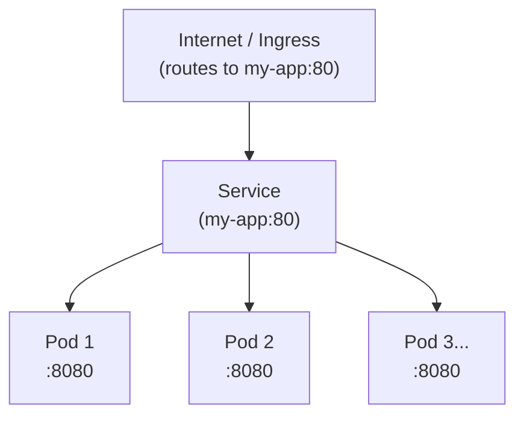

# Service Configuration

Connect your application to the cluster network so it can receive traffic.

## What You'll Configure

A **Service** is a Kubernetes resource that creates a stable network endpoint (IP and DNS name) for your application. It's essential for communication between applications and from external traffic.

**Why you need it:**
- Pods are temporary - they get created and destroyed
- Services provide a stable, permanent address that never changes
- Enables load balancing across multiple pod replicas
- Makes applications discoverable by other applications in the cluster

[!ref target="blank" text="Learn more about Services" icon="link-external"](https://kubernetes.io/docs/concepts/services-networking/service/)

---

## How It Works

**Ingress** --> routes external HTTP/HTTPS traffic to the Service <br/>
**Service** --> stable entry point, automatically sends traffic to any healthy pod <br/>
**Pods** --> temporary instances running your app



---

## Step 1: Create a Basic Service

Create `k8s/base/service.yaml`:

```yaml
apiVersion: v1
kind: Service
metadata:
  name: my-app
spec:
  type: ClusterIP  # Internal cluster DNS only
  selector:
    app: my-app    # Match deployment labels
  ports:
  - name: http
    port: 80       # External port (used by Ingress)
    targetPort: 8080  # Container port (what app listens on)
    protocol: TCP
```

**What this does:**
- Creates a stable IP address: `my-app.default.svc.cluster.local`
- Listens on port 80 (receives traffic from Ingress)
- Forwards traffic to container port 8080
- Automatically load balances across all pods with label `app=my-app`

### Add to Kustomization

Update `k8s/base/kustomization.yaml`:

```yaml
resources:
- deployment.yaml
- service.yaml  # Add this
```

---

## Service Types

### ClusterIP (Default)
Internal DNS only - accessible from within cluster.

```yaml
spec:
  type: ClusterIP
```

**Use when:** Your app is accessed only via Ingress or by other cluster applications

**DNS name:** `my-app.default.svc.cluster.local`

---

### NodePort
Exposes service on every node at a specific port (30000-32767).

```yaml
spec:
  type: NodePort
  ports:
  - port: 80
    targetPort: 8080
    nodePort: 30080  # External port on nodes
```

**Use when:** You need direct node access or testing

**Access:** `node-ip:30080` from outside cluster

**⚠️ Not recommended for production** - use Ingress instead

---

### LoadBalancer
Creates an external load balancer (AWS ELB/ALB).

```yaml
spec:
  type: LoadBalancer
  ports:
  - port: 80
    targetPort: 8080
```

**Use when:** You want a load balancer without Ingress

**Creates:** AWS Application Load Balancer (ALB) automatically

**Cost:** More expensive than Ingress

---

### ExternalName
Routes to an external service outside the cluster.

```yaml
spec:
  type: ExternalName
  externalName: api.external-service.com
  ports:
  - port: 443
```

**Use when:** Cluster needs to access external APIs

**DNS name:** `my-service.default.svc.cluster.local` → `api.external-service.com`

---

## Port Mapping

Understanding port configuration:

```yaml
ports:
- name: http
  port: 80           # ← Service port (external)
  targetPort: 8080   # ← Pod port (what container listens on)
  protocol: TCP
```

| Port | Direction | Example |
|------|-----------|---------|
| **service.port** | External | Ingress sends traffic to `:80` |
| **targetPort** | Internal | Pod receives on `:8080` |

**Example flow:**
```
Ingress → Service:80 → Pod:8080 (container)
```

---

## Selecting Pods

Services route to pods using label selectors:

```yaml
spec:
  selector:
    app: my-app    # Match pod labels
    tier: backend  # Can use multiple labels
```

**Pods must have matching labels:**

```yaml
# In deployment.yaml
template:
  metadata:
    labels:
      app: my-app      # ← Matches selector
      tier: backend    # ← Matches selector
      version: 1.0.0   # ← Not needed by selector
```

---

## Multi-Port Services

Expose multiple ports:

```yaml
apiVersion: v1
kind: Service
metadata:
  name: my-app
spec:
  type: ClusterIP
  selector:
    app: my-app
  ports:
  - name: http
    port: 80
    targetPort: 8080
  - name: metrics
    port: 9090
    targetPort: 9090
  - name: debug
    port: 9200
    targetPort: 9200
```

**DNS names:**
- `my-app:80` (default port)
- `my-app:9090` (metrics)
- `my-app:9200` (debug)

---

## Health-Aware Load Balancing

Services only route to pods that are "Ready":

```yaml
# In deployment.yaml
spec:
  template:
    spec:
      containers:
      - name: my-app
        readinessProbe:
          httpGet:
            path: /health
            port: 8080
          initialDelaySeconds: 10
          periodSeconds: 5
```

**What this does:**
- Service regularly checks `/health` endpoint
- Only healthy pods receive traffic
- Unhealthy pods temporarily removed from load balancing
- Automatically re-added when healthy again

---

## Service Discovery

### From Within Cluster

Any pod can reach your service:

```bash
# Full DNS name (works in any namespace)
my-app.default.svc.cluster.local

# Short name (same namespace)
my-app

# Environment variables (auto-injected)
MY_APP_SERVICE_HOST=10.0.1.100
MY_APP_SERVICE_PORT=80
```

### From Applications

Example Node.js app accessing another service:

```javascript
const http = require('http');

// Use short name (same namespace)
http.get('http://database-service:5432', (res) => {
  console.log('Connected to database');
});
```

---

## Complete Example

Web application with database service:

**deployment.yaml:**
```yaml
apiVersion: apps/v1
kind: Deployment
metadata:
  name: web-app
spec:
  replicas: 3
  selector:
    matchLabels:
      app: web-app
  template:
    metadata:
      labels:
        app: web-app
    spec:
      containers:
      - name: web-app
        image: web-app:1.0.0
        ports:
        - containerPort: 8080
        env:
        - name: DATABASE_HOST
          value: database-service  # Service DNS name
        - name: DATABASE_PORT
          value: "5432"
        readinessProbe:
          httpGet:
            path: /health
            port: 8080
```

**service.yaml:**
```yaml
apiVersion: v1
kind: Service
metadata:
  name: web-app
spec:
  type: ClusterIP
  selector:
    app: web-app
  ports:
  - name: http
    port: 80
    targetPort: 8080
```

**database-service.yaml:**
```yaml
apiVersion: v1
kind: Service
metadata:
  name: database-service
spec:
  type: ClusterIP
  selector:
    app: database
  ports:
  - port: 5432
    targetPort: 5432
```

---

## Troubleshooting

### Service has no endpoints

**Check pod labels match service selector:**
1. Review your service YAML to verify the `selector` labels
2. Review your deployment YAML to verify pod template labels match
3. In Grafana, check **Kubernetes / Compute Resources / Namespace (Pods)** to see if pods are running

**Fix:** Update pod labels in deployment to match selector

### Pod unhealthy, not receiving traffic

**Check readiness probe in Grafana:**
1. Open [Grafana](https://g-05c60f9e9b.grafana-workspace.us-east-1.amazonaws.com/)
2. Navigate to **Explore → Loki**
3. Query: `{namespace="<your-namespace>", pod="<pod-name>"} |= "readiness"`
4. Review health check failures

**Verify your manifest:**
- Check `targetPort` in Service matches `containerPort` in Deployment
- Verify `/health` endpoint is implemented and returning 200

### Can't reach service from other pod

**Check connectivity:**
- Verify service name matches in your application configuration
- Check network policies aren't blocking traffic
- Review service port vs target port configuration

**For DNS or networking issues**, contact **Infra-Argo-Global** via ServiceNow.

---

## Best Practices

### 1. Always Match Labels

Service selectors must exactly match pod labels - this is critical for traffic routing:

```yaml
# Service
spec:
  selector:
    app: my-app  # ← Must match

# Deployment pod template
template:
  metadata:
    labels:
      app: my-app  # ← Must match exactly
```

**Verification:**
Review your YAML files to ensure labels match exactly.

### 2. Configure Readiness Probes

Ensure only healthy pods receive traffic:

```yaml
readinessProbe:
  httpGet:
    path: /health
    port: 8080
  initialDelaySeconds: 10
  periodSeconds: 5
```

Without readiness probes, the Service will route traffic to unhealthy pods. [!ref For detailed guidance, see Health Checks](../getting-started/kubernetes-manifests.md#2-configure-health-checks).

### 3. Set Resource Requests

Required for Kubernetes to schedule pods correctly and for auto-scaling:

```yaml
resources:
  requests:
    cpu: 100m
    memory: 128Mi
  limits:
    cpu: 500m
    memory: 512Mi
```

For resource allocation guidance, [!ref see the Resource Allocation guide](./resource-allocation.md).

### 4. Use Named Ports

Makes configurations clearer and easier to maintain:

```yaml
ports:
- name: http    # Named port
  port: 80
  targetPort: 8080
```

Named ports are especially useful for multi-port services and Ingress rules.

### 5. Service Discovery Best Practices

- **Same namespace:** Use short DNS name `my-service`
- **Different namespace:** Use full name `my-service.other-namespace.svc.cluster.local`
- **External APIs:** Use `ExternalName` service type for external endpoints

For advanced Service configurations, [!ref see the Kubernetes Service documentation](https://kubernetes.io/docs/concepts/services-networking/service/).

---

## Common Service Configurations

### Simple Web App
```yaml
spec:
  type: ClusterIP
  selector:
    app: web-app
  ports:
  - port: 80
    targetPort: 8080
```

### API with Metrics Port
```yaml
spec:
  type: ClusterIP
  selector:
    app: api
  ports:
  - name: api
    port: 8000
    targetPort: 8000
  - name: metrics
    port: 9090
    targetPort: 9090
```

### Session Affinity (Sticky)
```yaml
spec:
  type: ClusterIP
  selector:
    app: web-app
  sessionAffinity: ClientIP  # Route same client to same pod
  sessionAffinityConfig:
    clientIP:
      timeoutSeconds: 3600
```

---

## Next Steps

[!ref icon="globe" text="Web Access & Hostnames"](./web-access-hostnames.md)

[!ref icon="pulse" text="Health Checks"](../getting-started/kubernetes-manifests.md#2-configure-health-checks)

[!ref icon="zap" text="High Availability"](./high-availability.md)

[!ref icon="server" text="Resource Allocation"](./resource-allocation.md)
