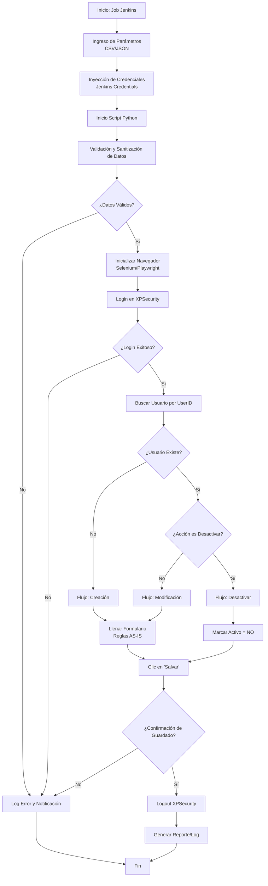

Excelente elección. La **Opción 2 (Python + Selenium/Playwright + Jenkins)** es la más robusta para integrar validaciones de lógica de negocio antes de interactuar con la UI y permite un control total del versionado.

A continuación, presento la estructura detallada para construir tu **Diagrama de Flujo**. He dividido el proceso en fases lógicas que puedes representar como "carriles" (swimlanes) o bloques secuenciales en tu herramienta de diagramación (Visio, Draw.io, Lucidchart).

### 1. Representación Visual del Flujo (Borrador)

Puedes usar este código Mermaid para visualizar la lógica rápidamente o guiarte para dibujar los cuadros:



---

### 2. Paso a Paso para el Diagrama de Flujo

Aquí tienes la descripción detallada de cada nodo del diagrama. Copia esta información en las cajas de tu diagrama y en la documentación técnica.

| ID | Nombre del Paso | Descripción Técnica | Herramienta | Reglas de Negocio (AS-IS) |
| :--- | :--- | :--- | :--- | :--- |
| **1** | **Inicio: Job Jenkins** | Disparo del pipeline de automatización. Puede ser manual o programado. | Jenkins | Reemplaza la "Recepción de solicitud" del AS-IS. |
| **2** | **Ingreso de Parámetros** | El script recibe los datos del usuario (Nombre, ID, Email, Tipo de Gestión). Se sugiere un archivo JSON o CSV seguro. | Jenkins / Python | Debe contener: UserID, Nombres, Cargo, Email, Tipo (Interno/Externo). |
| **3** | **Inyección de Credenciales** | Jenkins inyecta las credenciales del usuario administrador de XPSecurity como variables de entorno seguras. | Jenkins Credentials | **Seguridad:** Nunca hardcodear usuario/pass en el script. |
| **4** | **Validación y Sanitización** | El script Python valida que los campos no estén vacíos y normaliza el formato. | Python | **Usuario:** Convertir a MAYÚSCULAS.<br>**Nombres:** Convertir a MAYÚSCULAS.<br>**Canal:** Forzar valor "CANAL 1". |
| **5** | **Inicializar Navegador** | Lanzamiento de instancia de Chrome/Firefox (Headless o Visible). | Python (Selenium) | Se recomienda visible inicialmente para depuración de selectores. |
| **6** | **Login en XPSecurity** | Navegación a la URL de login e ingreso de credenciales administrativas. | Python (Selenium) | Autenticación técnica para permitir la gestión. |
| **7** | **Buscar Usuario** | Intentar buscar el UserID en la consola para determinar si existe. | Python (Selenium) | **Identificación:** Usar UserID (Mayúsculas) como llave única. |
| **8** | **Decisión: Flujo** | Lógica condicional basada en la existencia del usuario y el tipo de solicitud. | Python | **Crear:** Si no existe.<br>**Modificar:** Si existe y es actualización.<br>**Desactivar:** Si es baja (Offboarding). |
| **9** | **Llenar Formulario** | Interacción con los campos del formulario web (Inputs, Selects, Checkboxes). | Python (Selenium) | **Contraseña:** Generar temporal.<br>**Habilitar Contraseña:** Sí (Lineamiento técnico).<br>**Estado:** Activo (Sí).<br>**Del sistema:** NO. |
| **10** | **Desactivar Usuario** | Caso específico para bajas. Busca usuario y cambia estado. | Python (Selenium) | **Estado:** Cambiar check "Activo" a **NO**.<br>**Identificador:** Respetar UserID histórico. |
| **11** | **Confirmar Cambios** | Ejecución del clic en el botón de guardado y espera de mensaje de éxito. | Python (Selenium) | Se debe dar clic en **"Salvar"**. Validar mensaje de éxito en UI. |
| **12** | **Logout XPSecurity** | Cierre de sesión seguro en la aplicación para liberar la licencia/ sesión. | Python (Selenium) | Buenas prácticas de seguridad. |
| **13** | **Generar Reporte** | Creación de un log (txt/csv) con el resultado (Éxito/Fallo) y hora. | Python / Jenkins | Reemplaza la "Documentación y cierre del ticket". |
| **14** | **Fin** | Terminación del job. Jenkins envía notificación final (email/Slack). | Jenkins | Notificar al solicitante que la gestión está lista para validar. |

---

### 3. Detalles de Implementación para los Pasos Críticos

Para que tu diagrama sea técnicamente viable, ten en cuenta estos detalles al momento de desarrollar el script (Paso 4, 9 y 10):

#### A. Sanitización de Datos (Paso 4)
En tu código Python, antes de tocar el navegador, asegura esto:
```python
# Ejemplo de lógica de sanitización
user_id = input_data['userid'].upper()  # Regla: UserID todo en mayúscula
nombre_completo = input_data['nombre'].upper() # Regla: Nombres en MAYÚSCULA
canal = "CANAL 1" # Regla: Fijo
habilitar_pass = "Sí" # Regla: Lineamiento histórico (aunque use SmartPass)
```

#### B. Manejo de Selectores Web (Paso 9 y 10)
Dado que no hay API, el script dependerá del HTML. En tu diagrama, puedes añadir una nota técnica: *"Los selectores (XPath/CSS) deben ser mantenidos si la UI de XPSecurity cambia"*.
*   **Campo Estado:** Para creación es `Checked` (Activo). Para baja (Paso 10) es `Unchecked` (No Activo).
*   **Campo Usuario Interno/Externo:** Mapear el input "Interno: Y/N" al Dropdown o Radio Button correspondiente en la web.

#### C. Gestión de Errores (Excepciones)
En el diagrama, desde los pasos 6, 7 y 11, debes dibujar flechas de error que lleven al **Paso 13 (Generar Reporte)** pero con estado "FALLIDO", para que el equipo SAM sepa que la automatización no completó la tarea y debe intervenir manualmente.

### 4. Siguientes Pasos Sugeridos
1.  **Dibuja el diagrama** usando la tabla anterior como base.
2.  **Inspecciona la web XPSecurity:** Usa las herramientas de desarrollador del navegador (F12) para identificar los `id`, `name` o `xpath` de los campos críticos (Usuario, Contraseña, Botón Salvar).
3.  **Configura Jenkins:** Crea las "Credentials" para el usuario administrador de XPSecurity.
4.  **Prueba Piloto:** Ejecuta el script con un usuario de prueba antes de conectarlo a solicitudes reales.

¿Te gustaría que profundice en algún paso específico, como por ejemplo, cómo estructurar el script de Python para manejar los selectores de la web?
